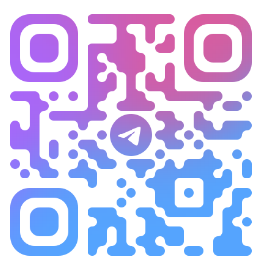
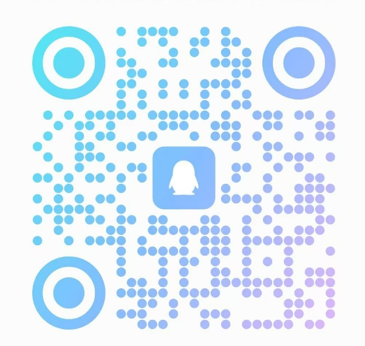

<br/>
<div align="center">

[](https://ant-design.antgroup.com/components/overview)
[![][github-contributors-shield]][github-contributors-link]
[![][github-stars-shield]][github-stars-link]
[](https://www.nuget.org/packages/AtomUI.Desktop.Controls)
[![][github-license-shield]][github-license-link]

[Changelog](./CHANGELOG.md) · [Report Bug][github-issues-link] · [Request Feature][github-issues-link]

</div>


[github-release-shield]: https://img.shields.io/github/v/release/AtomUI/AtomUI?color=369eff&labelColor=black&logo=github&style=flat-square

[github-release-link]: https://github.com/AtomUI/AtomUI/releases

[github-releasedate-shield]: https://img.shields.io/github/release-date/AtomUI/AtomUI?color=black&labelColor=black&style=flat-square

[github-releasedate-link]: https://github.com/AtomUI/AtomUI/releases

[github-contributors-shield]: https://img.shields.io/github/contributors/AtomUI/AtomUI?color=c4f042&labelColor=black&style=flat-square

[github-contributors-link]: https://github.com/AtomUI/AtomUI/graphs/contributors

[github-forks-shield]: https://img.shields.io/github/forks/AtomUI/AtomUI?color=8ae8ff&labelColor=black&style=flat-square

[github-forks-link]: https://github.com/AtomUI/AtomUI/network/members

[github-stars-shield]: https://img.shields.io/github/stars/AtomUI/AtomUI?color=ffcb47&labelColor=black&style=flat-square

[github-stars-link]: https://github.com/AtomUI/AtomUI/network/stargazers

[github-issues-shield]: https://img.shields.io/github/issues/AtomUI/AtomUI?color=ff80eb&labelColor=black&style=flat-square

[github-issues-link]: https://github.com/AtomUI/AtomUI/issues

[github-license-shield]: https://img.shields.io/github/license/AtomUI/AtomUI?color=white&labelColor=black&style=flat-square

[github-license-link]: https://github.com/AtomUI/AtomUI/blob/master/LICENSE

Documentation Language: [English](README.md) | [简体中文](README.zh-CN.md)

#### Introduce

AtomUI is an implementation of Ant Design based on .NET technology, dedicated to bringing the excellent and efficient
design language and experience of Ant Design to the Avalonia/.NET cross-platform desktop software development field.

Welcome to communicate and give suggestions to AtomUI, thank you for giving the project a Star.


#### Features

- Enterprise-class UI designed from Ant Design system for cross platform desktop applications.
- A set of high-quality Avalonia Controls out of the box.
- Use .NET development to achieve one-stop writing, seamless compilation on mainstream operating system platforms and
  render a consistent UI experience.
- Based on Avalonia's powerful style system, Ant Design's theme customization capabilities are fully implemented.

#### Incubator

Thanks to Tongming Lake Center for their incubation support of AtomUI OSS

<div style="margin-top: 50px">
  
</div>

#### Community

<div align="center">
    <table>
      <tr>
        <th>Telegram</th>
        <th>WhatsApp</th>
        <th>Wechat Group</th>
        <th>QQ Group</th>
      </tr>
      <tr>
        <td> </td>
        <td> </td>
        <td></td>
        <td></td>
      </tr>
    </table>
</div>

#### Get Started

##### Add nuget package:

AtomUI is recommended to be installed as a nuget package. We have uploaded AtomUI OSS-related packages to nuget.org.
Currently, AtomUI
has not released a long-term support version, so it is recommended to install the latest version we have released

The packages we have released are as follows:

| Package                             | Description                                                                                                                                |
|-------------------------------------|--------------------------------------------------------------------------------------------------------------------------------------------|
| AtomUI.Core                         | Core infrastructure — Theme system, Token system, animations                                                                               |
| AtomUI.Controls.Shared              | Shared interfaces and enums for control development                                                                                        |
| AtomUI.Desktop.Controls             | Desktop control library — the main package                                                                                                 |
| AtomUI.Desktop.Controls.DataGrid    | DataGrid control (opt-in)                                                                                                                  |
| AtomUI.Desktop.Controls.ColorPicker | ColorPicker control (opt-in)                                                                                                               |
| AtomUI.Generator                    | Source generators for custom control development                                                                                           |
| AtomUI.Fonts.AlibabaSans            | Alibaba Sans font package                                                                                                                  |

```bash
dotnet add package AtomUI --version 5.2.0-build.4
```

You can install nuget packages one by one directly. If the above command line fails to complete the installation, please go to the NuGet package manager. In Rider, you can click on the following steps:

nuget -> packages

Searching for "AtomUI" will find available AtomUI packages. Then, install them one by one.

> Before installation, please click on "Framework and Dependencies" on the right to ensure that the corresponding dependency packages are compatible.

##### Enable AtomUI library

###### Project Configure

```xaml
<Project Sdk="Microsoft.NET.Sdk">
    <PropertyGroup>
        <OutputType>WinExe</OutputType>
        <TargetFramework>net10.0</TargetFramework>
        <Nullable>enable</Nullable>
        <BuiltInComInteropSupport>true</BuiltInComInteropSupport>
        <ApplicationManifest>app.manifest</ApplicationManifest>
        <AvaloniaUseCompiledBindingsByDefault>true</AvaloniaUseCompiledBindingsByDefault>
    </PropertyGroup>

    <ItemGroup>
        <PackageReference Include="AtomUI" Version="5.2.0-build.4"/>
        <PackageReference Include="Avalonia.Diagnostics" Version="11.3.12">
            <IncludeAssets Condition="'$(Configuration)' != 'Debug'">None</IncludeAssets>
            <PrivateAssets Condition="'$(Configuration)' != 'Debug'">All</PrivateAssets>
        </PackageReference>
    </ItemGroup>
</Project>
```

###### Program.cs Configure

```csharp
using Avalonia;
using System;
namespace AtomUIProgressApp;
class Program
{
    [STAThread]
    public static void Main(string[] args) => BuildAvaloniaApp()
        .StartWithClassicDesktopLifetime(args);
    public static AppBuilder BuildAvaloniaApp()
    {
        return AppBuilder.Configure<App>()
            .UseReactiveUI()
            .UsePlatformDetect()
            .With(new Win32PlatformOptions())
            .LogToTrace();
    }
}
```

###### Enable `AtomUI` in the `Application` Class

```csharp
public partial class App : Application
{
    public override void Initialize()
    {
        base.Initialize();
        AvaloniaXamlLoader.Load(this);
        this.UseAtomUI(builder =>
        {
            builder.WithDefaultTheme(IThemeManager.DEFAULT_THEME_ID);
            builder.UseAlibabaSansFont();
            builder.UseDesktopControls();
            builder.UseDesktopDataGrid();      // optional
            builder.UseDesktopColorPicker();   // optional
        });
    }
}
```

###### Enjoy using AtomUI to create unlimited possibilities

You can start using it in your own projects

```xml
<atom:Window xmlns="https://github.com/avaloniaui"
             xmlns:atom="https://atomui.net"
             xmlns:antdicons="https://atomui.net/icons/antdesign">
  <atom:Space Orientation="Horizontal">
    <atom:Button ButtonType="Primary">Get Started</atom:Button>
    <atom:Button Icon="{antdicons:AntDesignIconProvider StarOutlined}">Star on GitHub</atom:Button>
  </atom:Space>
</atom:Window>
```

<div style="height:50px"></div>

#### All Control Gallery

You can launch the `./controlgallery/AtomUIGallery.Desktop/AtomUIGallery.Desktop.csproj` project in your local development environment to experience all AtomUI controls.

```bash
git clone https://github.com/AtomUI/AtomUI.git
cd AtomUI
dotnet run --project controlgallery/AtomUIGallery.Desktop/AtomUIGallery.Desktop.csproj
```

<div style="height:50px"></div>

#### Simple Examples

AtomUI's gallery project can be quite large and complex, and if you're new to AtomUI, you might feel overwhelmed. You can visit

[AtomUI/AtomUI.Examples](https://github.com/AtomUI/AtomUI.Samples)

to check out our simple and compact sample projects to help you get started with AtomUI.

#### Acknowledgements

<div>
    <div align="center">
      <h1>Ant Design</h1>
      
    </div>
Ant Design is an enterprise-level UI design language and React component library launched by Ant Group. It provides a set of high-quality, unified React components with rich preset themes and internationalization support, dedicated to improving the design and development efficiency of enterprise applications. Its elegant design and excellent development experience make it one of the most popular front-end solutions for middle and back-end projects.
</div>

<div style="margin-top: 50px">
    <div align="center">
        <h1>Avalonia OSS</h1>
        
    </div>
Avalonia is a cross-platform .NET UI framework that uses XAML language for interface design. It supports multiple platforms including Windows, macOS, Linux, iOS, and Android, providing a development experience similar to WPF. With its high-performance rendering engine and rich control library, Avalonia helps enterprises quickly build modern desktop and mobile applications.

</div>

#### License Description

Projects using AtomUI OSS need to comply with the LGPL v3 agreement. <strong>Commercial applications (including but not
limited to internal company projects, commercial projects developed by individuals using AtomUI OSS, and outsourced
projects) are free when using binary links</strong>. If you want to customize AtomUI based on source code, you need to
modify the open source code or purchase a commercial license. If you need a commercial license, please contact: Beijing
Qinware Technology Co., Ltd.

#### Special thanks

<div>
    <div align="left">
      <h1>RoutinAI</h1>
       
    </div>
[RoutinAI](https://routin.ai/) is an enterprise-grade unified LLM API gateway that provides a single, type-safe interface to access over 100 leading large language models from the GPT, Claude, and Gemini families, including models such as gpt-5.4, claude-opus-4-6, and gemini-3.1-pro-preview. It eliminates the complexity of managing multiple AI vendors by providing zero-latency edge routing, seamless model switching without code modifications, unified billing, and centralized governance with spending caps and access policies.
</div>

### 🤝 Contributing

Contributions of all types are more than welcome, if you are interested in contributing code, feel free to check out our
GitHub [Issues][github-issues-link] to get stuck in to show us what you’re made of.

[![][pr-welcome-shield]][pr-welcome-link]

[![][github-contrib-shield]][github-contrib-link]

[github-issues-link]: https://github.com/AtomUI/AtomUI/issues

[pr-welcome-shield]: https://img.shields.io/badge/PR%20WELCOME-%E2%86%92-ffcb47?labelColor=black&style=for-the-badge

[pr-welcome-link]: https://github.com/AtomUI/AtomUI/pulls

[github-contrib-shield]: https://contrib.rocks/image?repo=chinware%2FAtomUI

[github-contrib-link]: https://github.com/AtomUI/AtomUI/graphs/contributors
