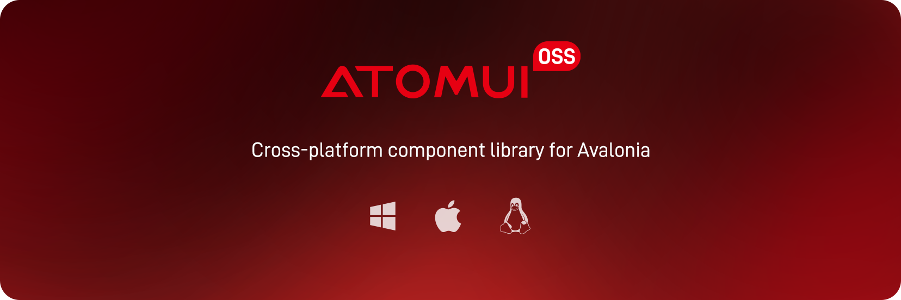
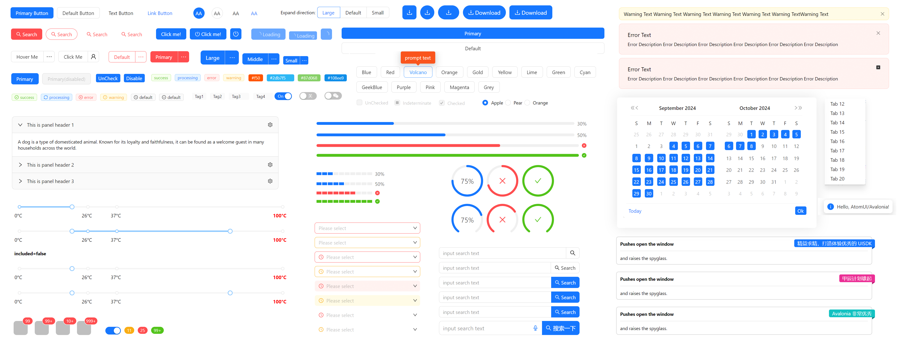
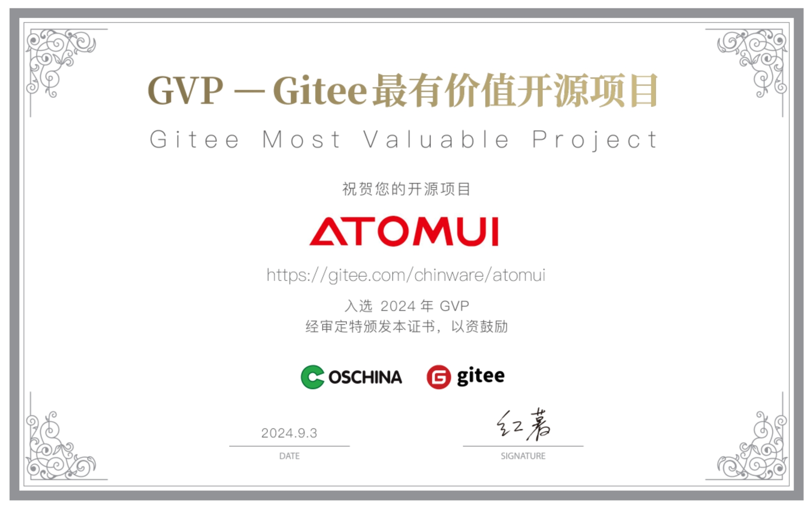

<br/>
<div align="center">

[](https://ant-design.antgroup.com/components/overview-cn)
[](https://www.nuget.org/packages/AtomUI.Desktop.Controls)
[![][github-license-shield]][github-license-link]

[更新日志](./CHANGELOG.md) · [提交Bug][github-issues-link] · [提交需求][github-issues-link]

</div>


[github-release-shield]: https://img.shields.io/github/v/release/AtomUI/AtomUI?color=369eff&labelColor=black&logo=github&style=flat-square

[github-release-link]: https://github.com/AtomUI/AtomUI/releases

[github-releasedate-shield]: https://img.shields.io/github/release-date/AtomUI/AtomUI?color=black&labelColor=black&style=flat-square

[github-releasedate-link]: https://github.com/AtomUI/AtomUI/releases

[github-contributors-shield]: https://img.shields.io/github/contributors/AtomUI/AtomUI?color=c4f042&labelColor=black&style=flat-square

[github-contributors-link]: https://github.com/AtomUI/AtomUI/graphs/contributors

[github-forks-shield]: https://img.shields.io/github/forks/AtomUI/AtomUI?color=8ae8ff&labelColor=black&style=flat-square

[github-forks-link]: https://github.com/AtomUI/AtomUI/network/members

[github-stars-shield]: https://img.shields.io/github/stars/AtomUI/AtomUI?color=ffcb47&labelColor=black&style=flat-square

[github-stars-link]: https://github.com/AtomUI/AtomUI/network/stargazers

[github-issues-shield]: https://img.shields.io/github/issues/AtomUI/AtomUI?color=ff80eb&labelColor=black&style=flat-square

[github-issues-link]: https://github.com/AtomUI/AtomUI/issues

[github-license-shield]: https://img.shields.io/github/license/AtomUI/AtomUI?color=white&labelColor=black&style=flat-square

[github-license-link]: https://github.com/AtomUI/AtomUI/blob/master/LICENSE

文档语言: [English](README.md) | [简体中文](README.zh-CN.md)

#### 介绍

AtomUI 是基于 .NET 技术的 Ant Design 实现，致力于将 Ant Design 优秀而高效的设计语言和体验带入 Avalonia/.NET 跨平台桌面软件开发领域。
欢迎与 AtomUI 进行交流并提出建议，感谢您为该项目点赞。



#### 特性

- 实现 Ant Design 提炼自企业级中后台产品的交互语言和视觉风格。
- 开箱即用的高质量 Avalonia 组件。
- 使用 .NET 开发，实现一处编写，无缝在主流操作系统平台编译并且渲染出一致的 UI 体验。
- 基于 Avalonia 强大的风格系统，完整实现了 Ant Design 的主题定制能力。

#### 运行环境

.NET 8 及其以上（开发期支持 .NET 10）<br>
Avalonia 11.3.x<br>
支持 Windows、macOS、Linux 跨平台<br>

#### 感谢通明湖中心孵化 AtomUI OSS

<div style="margin-top: 50px">
  
</div>

#### 感谢 Gitee 对 AtomUI 的认可

<p align="center">
    
</p>

#### 中文社区

目前我们暂时只创建 QQ 和微信开发者群的交流方式，下面是二维码，有兴趣的同学可以扫码加入：

<table border="0">
    <tbody>
        <tr>
            <td align="center" valign="middle">
                
            </td>
            <td align="center" valign="middle">
                
            </td>
        </tr>
    </tbody>
</table>

> PS：扫码请注明来意，比如：学习`AtomUI`或者`Avalonia`爱好者

#### 开始使用

AtomUI 推荐的以 nuget 包的方式进行安装，我们已经将 AtomUI OSS 相关的包上传到 nuget.org，目前 AtomUI
没有发布长期支持版，所以推荐安装我们发布的最新版本

目前我们已经发布的包如下：

| 包名                                  | 描述                                                 |
|-------------------------------------|----------------------------------------------------|
| AtomUI.Core                         | 核心基础设施 — 主题系统、Token 系统、动画                        |
| AtomUI.Controls.Shared              | 面向控件开发的共享接口与枚举                                    |
| AtomUI.Desktop.Controls             | 桌面控件库 — 主要安装包                                     |
| AtomUI.Desktop.Controls.DataGrid    | DataGrid 数据表格控件（按需引入）                             |
| AtomUI.Desktop.Controls.ColorPicker | ColorPicker 颜色选择器控件（按需引入）                         |
| AtomUI.Generator                    | 面向自定义控件开发的源代码生成器                                  |
| AtomUI.Fonts.AlibabaSans            | 阿里巴巴普惠体字体包                                         |

```bash
dotnet add package AtomUI --version 5.2.0-build.4
```

您也可以直接依次安装各个nuget包。如果上述命令行无法完成正常安装，请移步nuget包管理器，在rider中，您可以依次点击

nuget -> 软件包

搜索AtomUI，即可搜索到可用的AtomUI包。然后依次安装即可。

> 安装前请点击右侧 框架 和 依赖，确保满足相应的依赖包版本

##### 启用 AtomUI 库

###### 配置项目文件

```xaml
<Project Sdk="Microsoft.NET.Sdk">
    <PropertyGroup>
        <OutputType>WinExe</OutputType>
        <TargetFramework>net10.0</TargetFramework>
        <Nullable>enable</Nullable>
        <BuiltInComInteropSupport>true</BuiltInComInteropSupport>
        <ApplicationManifest>app.manifest</ApplicationManifest>
        <AvaloniaUseCompiledBindingsByDefault>true</AvaloniaUseCompiledBindingsByDefault>
    </PropertyGroup>

    <ItemGroup>
        <PackageReference Include="AtomUI" Version="5.2.0-build.4"/>
        <PackageReference Include="Avalonia.Diagnostics" Version="11.3.12">
            <IncludeAssets Condition="'$(Configuration)' != 'Debug'">None</IncludeAssets>
            <PrivateAssets Condition="'$(Configuration)' != 'Debug'">All</PrivateAssets>
        </PackageReference>
    </ItemGroup>
</Project>
```

###### 配置程序入口文件

```csharp
using Avalonia;
using System;
namespace AtomUIProgressApp;
class Program
{
    [STAThread]
    public static void Main(string[] args) => BuildAvaloniaApp()
        .StartWithClassicDesktopLifetime(args);
    public static AppBuilder BuildAvaloniaApp()
    {
        return AppBuilder.Configure<App>()
            .UseReactiveUI()
            .UsePlatformDetect()
            .With(new Win32PlatformOptions())
            .LogToTrace();
    }
}
```

###### 在 `Application` 类中启用 `AtomUI`

```csharp
public partial class App : Application
{
    public override void Initialize()
    {
        base.Initialize();
        AvaloniaXamlLoader.Load(this);
        this.UseAtomUI(builder =>
        {
            builder.WithDefaultTheme(IThemeManager.DEFAULT_THEME_ID);
            builder.UseAlibabaSansFont();
            builder.UseDesktopControls();
            builder.UseDesktopDataGrid();      // 可选
            builder.UseDesktopColorPicker();   // 可选
        });
    }
}
```

###### 开始用 `AtomUI` 创造无限可能

您可以开始在自己的项目中开始使用 `AtomUI`

```xml
<atom:Window xmlns="https://github.com/avaloniaui"
             xmlns:atom="https://atomui.net"
             xmlns:antdicons="https://atomui.net/icons/antdesign">
    <atom:Space Orientation="Horizontal">
        <atom:Button ButtonType="Primary">开始使用</atom:Button>
        <atom:Button Icon="{antdicons:AntDesignIconProvider StarOutlined}">在 GitHub 上点赞</atom:Button>
    </atom:Space>
</atom:Window>
```

<div style="height:50px"></div>

#### 体验所有控件

您可以启动 `./controlgallery/AtomUIGallery.Desktop/AtomUIGallery.Desktop.csproj` 项目在本机开发环境来体验所有的 AtomUI 控件

```bash
git clone https://github.com/AtomUI/AtomUI.git
cd AtomUI
dotnet run --project controlgallery/AtomUIGallery.Desktop/AtomUIGallery.Desktop.csproj
```

<div style="height:50px"></div>

#### 小的示例项目

AtomUI 的 gallery 项目可能过于庞大繁杂，如果您刚开始接触 AtomUI，可能会感到无从下手，您可以前往

[AtomUI/AtomUI.Examples](https://github.com/AtomUI/AtomUI.Samples)

查看简单且小巧的示例项目。帮助您更好的上手 AtomUI。

#### 致谢

<div>
    <div align="center">
      <h1>Ant Design</h1>
      
    </div>
Ant Design 是由蚂蚁集团推出的企业级 UI 设计语言和 React 组件库。它提供了一套高质量、统一的 React 组件，包含丰富的预设主题与国际化支持，致力于提升企业级应用的设计和开发效率。其优雅的设计和出色的开发体验，使其成为中后台项目中最流行的前端解决方案之一。
</div>

<div style="margin-top: 50px">
    <div align="center">
        <h1>Avalonia OSS</h1>
        
    </div>
Avalonia 是一个跨平台的 .NET UI 框架，使用 XAML 语言设计界面。它支持 Windows、macOS、Linux、iOS 和 Android 等多个平台，提供与 WPF 相似的开发体验。凭借其高性能的渲染引擎和丰富的控件库，Avalonia 能够帮助企业快速构建现代化的桌面和移动应用程序。
</div>

#### 许可证说明

使用 AtomUI 的项目需要遵循 LGPL v3 协议，<strong>商业应用(包括且不限于公司内部项目、个人使用 AtomUI OSS
开发的商业项目和承接的外包项目)在使用二进制连接的情况下免费</strong>，如果基于源码定制 AtomUI
需要修改的代码开源或者购买商业授权，需要商业授权，欢迎联系：北京秦派软件科技有限公司。

### 🤝 贡献

欢迎各界人士贡献各种资源，如果您对贡献代码感兴趣，请随意查看我们的 GitHub [问题页面][github-issues-link]，让我们见识一下您的实力。

[![][pr-welcome-shield]][pr-welcome-link]

[![][github-contrib-shield]][github-contrib-link]

[github-issues-link]: https://github.com/AtomUI/AtomUI/issues

[pr-welcome-shield]: https://img.shields.io/badge/PR%20WELCOME-%E2%86%92-ffcb47?labelColor=black&style=for-the-badge

[pr-welcome-link]: https://github.com/AtomUI/AtomUI/pulls

[github-contrib-shield]: https://contrib.rocks/image?repo=chinware%2FAtomUI

[github-contrib-link]: https://github.com/AtomUI/AtomUI/graphs/contributors
