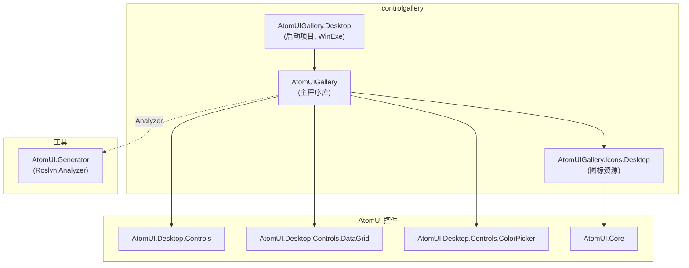
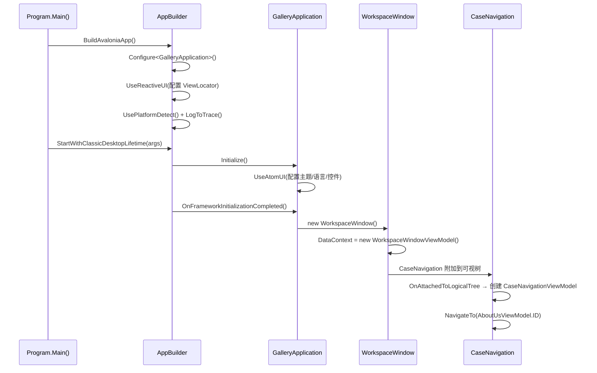

# AtomUI Gallery — 项目总览

> **文档版本**：2026-04-15  
> **目标读者**：需要迭代 Gallery 项目的开发者  
> **适用代码**：`controlgallery/` 目录下的全部源码

---

## 1. 项目简介

AtomUI Gallery 是 **AtomUI 控件库的官方演示程序**，用于直观展示和交互式体验所有 Ant Design 5.0 风格控件的外观与行为。它同时也是控件开发过程中的**可视化回归测试工具**。

主要功能：
- 分类展示所有 AtomUI 控件（General / Layout / Navigation / Data Entry / Data Display / Feedback 共 6 大类）
- 支持运行时切换：亮色/暗色主题、紧凑模式、动效开关、波浪动画、中/英文语言
- 支持窗口选项控制：全屏、固定、最小化、最大化、移动、调整大小
- 按 F5 自动逐页遍历全部 ShowCase（性能/稳定性测试）

---

## 2. 项目组成

Gallery 由 **3 个 .NET 项目** 组成：

| 项目 | 路径 | 职责 |
|---|---|---|
| **AtomUIGallery** | `controlgallery/AtomUIGallery/` | 主程序库：包含所有 View、ViewModel、Controls、Models、Utils、Localization、ShowCase 注册 |
| **AtomUIGallery.Desktop** | `controlgallery/AtomUIGallery.Desktop/` | 桌面平台启动项目：Program.cs 入口、GalleryApplication、平台配置、安装包资源 |
| **AtomUIGallery.Icons.Desktop** | `controlgallery/AtomUIGallery.Icons.Desktop/` | Gallery 专用图标资源（SVG → 图标自动生成） |

---

## 3. 技术栈总览

| 类目 | 技术 | 版本 |
|---|---|---|
| 语言 | C# (latest, nullable enabled) | — |
| 运行时 | .NET 10 (开发) / .NET 8 (发布) | 多目标 `$(AtomUITargetFrameworks)` |
| UI 框架 | Avalonia | 11.3.12 |
| MVVM 框架 | ReactiveUI.Avalonia | 11.4.12 |
| 补充 MVVM | CommunityToolkit.Mvvm | 8.4.2 |
| 控件库 | AtomUI.Desktop.Controls + ColorPicker + DataGrid | 5.2.0-build.3 |
| 源代码生成器 | AtomUI.Generator（Roslyn Analyzer） | — |
| 构建工具 | MSBuild / dotnet CLI | — |
| 平台 | Windows / macOS / Linux 桌面 | — |

---

## 4. 依赖关系图



> **Debug** 配置下使用 `<ProjectReference>` 直引本地源码；**Release** 配置下使用 `<PackageReference>` 引 NuGet 包。

---

## 5. 启动流程



### 关键初始化步骤详解

1. **`Program.cs`**：  
   - 调用 `UseReactiveUI(build => build.ConfigureViewLocator(locator => new ShowCaseViewModule().RegisterViews(locator)))` 注册所有 ViewModel → View 映射（AOT 兼容, `IViewModule` + `DefaultViewLocator.Map<VM,V>()`）
   - 配置字体回退（Microsoft YaHei）

2. **`GalleryApplication.Initialize()`**：  
   - 调用 `UseAtomUI()` 配置 AtomUI 主题系统
   - 注册控件主题包（Desktop Controls、DataGrid、ColorPicker、Gallery Controls）
   - 设置默认语言（zh_CN）和默认主题

3. **`GalleryApplication.OnFrameworkInitializationCompleted()`**：  
   - 创建 `WorkspaceWindow` 作为 `MainWindow`

4. **`WorkspaceWindow` 构造函数**：  
   - 设置 `DataContext = new WorkspaceWindowViewModel()`
   - `WorkspaceWindowViewModel` 实现 `IScreen`，持有 `RoutingState Router`

5. **`CaseNavigation.OnAttachedToLogicalTree()`**：  
   - 遍历父级找到 `IScreen` → 创建 `CaseNavigationViewModel(screen)`
   - 默认导航到 `AboutUsViewModel.ID`（"关于我们"页面）

---

## 6. 构建与运行

### 6.1 前置条件

- **.NET SDK 10.0**（主目标框架）
- **.NET SDK 8.0**（Desktop 项目多目标支持）
- 操作系统：Windows / macOS / Linux

### 6.2 构建命令

```bash
# Debug 模式（使用本地 ProjectReference 引用 AtomUI 源码）
dotnet build controlgallery/AtomUIGallery.Desktop/AtomUIGallery.Desktop.csproj

# Release 模式（使用 NuGet PackageReference）
dotnet build -c Release controlgallery/AtomUIGallery.Desktop/AtomUIGallery.Desktop.csproj

# 运行
dotnet run --project controlgallery/AtomUIGallery.Desktop/AtomUIGallery.Desktop.csproj
```

### 6.3 发布

```powershell
# 使用发布脚本
cd controlgallery/AtomUIGallery.Desktop/scripts
./PublishToLocal.ps1 -publishRootPath "/path/to/publish" -buildType "Release" -framework "net10.0" -runtime "osx-arm64"
```

支持的 Runtime Identifier：
- `osx-arm64` — macOS Apple Silicon
- `win-x64` — Windows 64-bit
- `linux-x64` — Linux 64-bit

### 6.4 目标框架

目标框架由 `$(AtomUITargetFrameworks)` MSBuild 属性控制：
- **Debug**: `net10.0`（仅开发框架）
- **Release**: `net10.0;net8.0`（多目标发布）

### 6.5 AOT/Trimming 状态

当前 AOT 和 Trimming 被注释掉（`AtomUIGallery.Desktop.csproj`）：

```xml
<!--<IsTrimmable>true</IsTrimmable>-->
<!--<PublishTrimmed>true</PublishTrimmed>-->
<!--<PublishAot>true</PublishAot>-->
```

---

## 7. 文档索引

| 文档 | 内容 |
|---|---|
| [02-DirectoryTree.md](02-DirectoryTree.md) | 完整目录树 |
| [03-Architecture.md](03-Architecture.md) | 架构设计详解（MVVM、路由、主题、本地化、图标） |
| [04-ShowCaseCatalog.md](04-ShowCaseCatalog.md) | ShowCase 完整清单与 ViewModel/View 映射表 |
| [05-CodingConventions.md](05-CodingConventions.md) | 编码规范摘要 |
| [06-RisksAndTechDebt.md](06-RisksAndTechDebt.md) | 风险点、技术债与迭代注意事项 |

---

## 8. 快速导航

- **项目整体结构** → [01-Overview.md](01-Overview.md)
- **MVVM 架构和数据流** → [03-Architecture.md](03-Architecture.md)
- **如何新增一个 ShowCase** → [04-ShowCaseCatalog.md](04-ShowCaseCatalog.md#新增-showcase-步骤)
- **导航路由机制** → [03-Architecture.md](03-Architecture.md#3-路由与导航机制)
- **主窗口菜单和主题切换** → [03-Architecture.md](03-Architecture.md#4-主题系统)
- **如何添加国际化文本** → [03-Architecture.md](03-Architecture.md#5-本地化系统)
- **图标系统** → [03-Architecture.md](03-Architecture.md#10-图标系统架构)
- **命名和编码规范** → [05-CodingConventions.md](05-CodingConventions.md)
- **有哪些风险和技术债** → [06-RisksAndTechDebt.md](06-RisksAndTechDebt.md)


