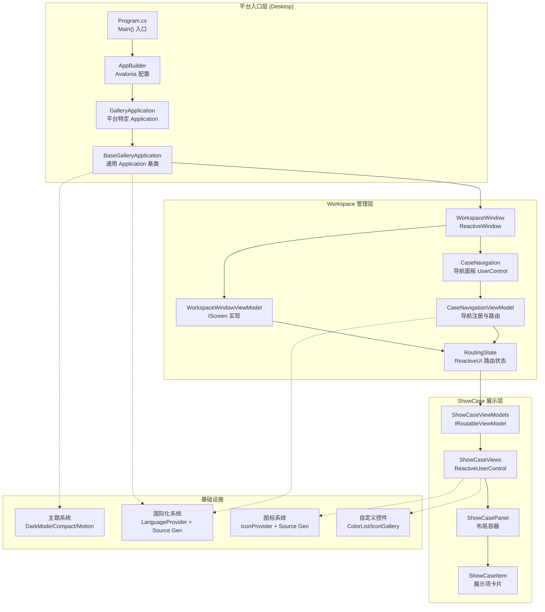
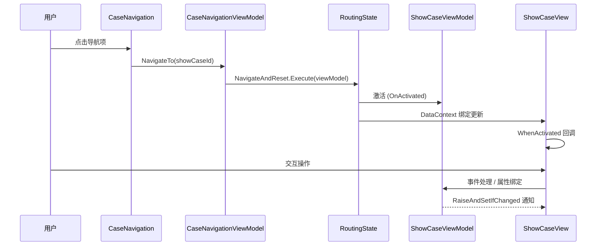
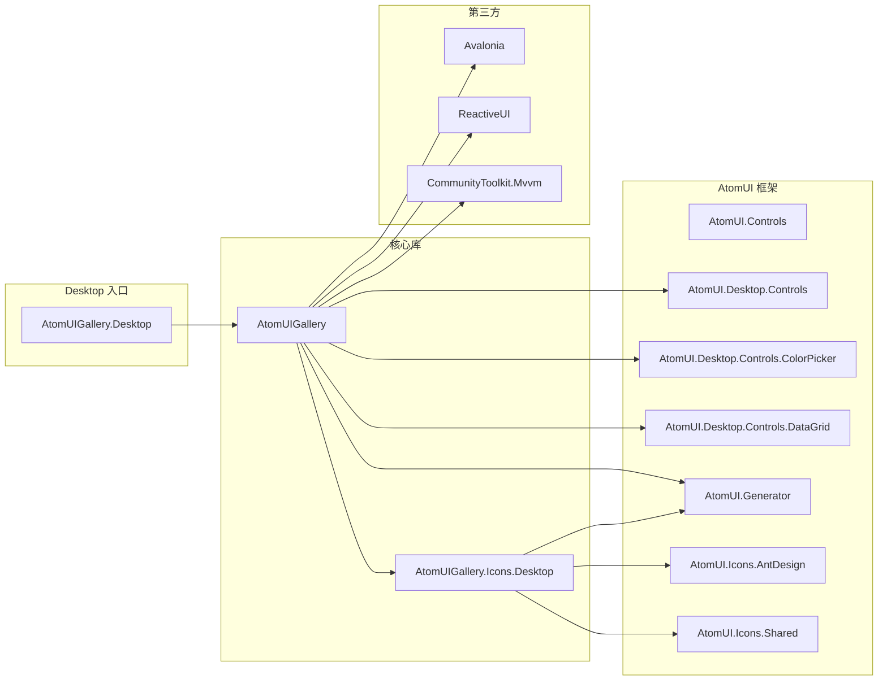
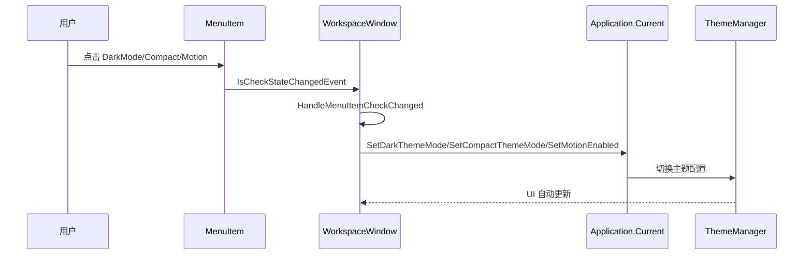
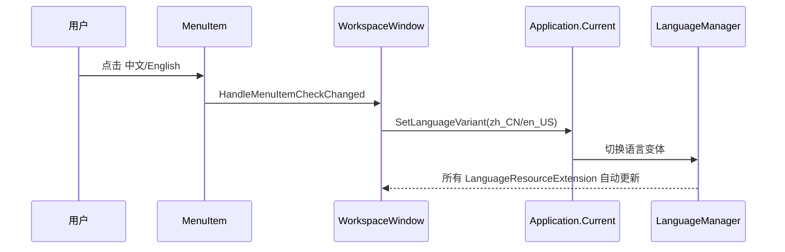
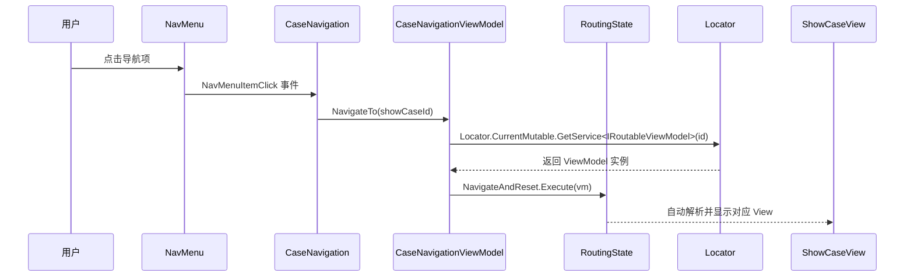

# AtomUIGallery 架构分析

## 1. 整体架构概览

AtomUIGallery 采用 **ReactiveUI MVVM** 架构模式，基于 Avalonia UI 框架构建。整体架构分为三层：平台入口层、Workspace 管理层、ShowCase 展示层。

### 1.1 架构图



## 2. MVVM 架构详解

### 2.1 ReactiveUI 核心类型映射

Gallery 使用 ReactiveUI 作为 MVVM 框架，以下是核心类型与 Gallery 实际使用的映射：

| ReactiveUI 类型 | Gallery 用途 | 实现类 |
|-----------------|-------------|--------|
| `ReactiveObject` | 所有 ViewModel 的基类 | `WorkspaceWindowViewModel`, `ButtonViewModel` 等 |
| `IScreen` | 路由宿主，持有 `RoutingState` | `WorkspaceWindowViewModel` |
| `RoutingState` | 管理导航堆栈 | `WorkspaceWindowViewModel.Router` |
| `IRoutableViewModel` | 可路由的 ViewModel | 所有 ShowCase ViewModel |
| `IActivatableViewModel` | 支持激活/停用生命周期 | 所有 ShowCase ViewModel |
| `ViewModelActivator` | 激活/停用管理器 | 每个 ShowCase ViewModel 持有 |
| `ReactiveWindow<T>` | 强类型 Window 基类 | `WorkspaceWindow` |
| `ReactiveUserControl<T>` | 强类型 UserControl 基类 | 所有 ShowCase View |
| `IViewFor<T>` | View-ViewModel 绑定接口 | `ReactiveWindow<T>` / `ReactiveUserControl<T>` 隐式实现 |

### 2.2 数据流



### 2.3 导航路由机制

Gallery 使用 ReactiveUI 的 `RoutingState` 实现导航：

1. **路由注册**：`CaseNavigationViewModel` 构造函数中通过 `Locator.CurrentMutable.Register` 注册 72 个 ShowCase 的 ViewModel 工厂
2. **导航触发**：用户点击 `NavMenu` 项 → `CaseNavigation.HandleNavMenuItemClick` → `CaseNavigationViewModel.NavigateTo(id)`
3. **路由执行**：`NavigateTo` 内部调用 `Router.NavigateAndReset.Execute(viewModel)`
4. **View 解析**：ReactiveUI 通过 `IViewFor` 接口自动解析对应的 View 类型
5. **生命周期**：`WhenActivated` 在 View 激活时触发，用于初始化和订阅管理

### 2.4 ViewModel 基类模式

所有 ShowCase ViewModel 遵循统一模式：

```csharp
public class XxxViewModel : ReactiveObject, IRoutableViewModel, IActivatableViewModel
{
    public static EntityKey ID = "Xxx";           // 唯一标识符
    public IScreen HostScreen { get; }             // 路由宿主引用
    public ViewModelActivator Activator { get; }   // 激活器
    public string UrlPathSegment { get; } = ID.ToString(); // 路由路径段

    // 响应式属性示例
    private SizeType _buttonSizeType;
    public SizeType ButtonSizeType
    {
        get => _buttonSizeType;
        set => this.RaiseAndSetIfChanged(ref _buttonSizeType, value);
    }

    public XxxViewModel(IScreen screen)
    {
        Activator  = new ViewModelActivator();
        HostScreen = screen;
    }
}
```

## 3. 模块划分

### 3.1 模块依赖图



### 3.2 命名空间结构

| 命名空间 | 所属项目 | 职责 |
|---------|---------|------|
| `AtomUIGallery` | AtomUIGallery | 应用基类、扩展方法 |
| `AtomUIGallery.Controls` | AtomUIGallery | 自定义 Gallery 控件 |
| `AtomUIGallery.ShowCases.ViewModels` | AtomUIGallery | ShowCase ViewModel 层 |
| `AtomUIGallery.ShowCases.Views` | AtomUIGallery | ShowCase View 层 |
| `AtomUIGallery.Workspace.ViewModels` | AtomUIGallery | Workspace ViewModel 层 |
| `AtomUIGallery.Workspace.Views` | AtomUIGallery | Workspace View 层 |
| `AtomUIGallery.Workspace.Localization.*` | AtomUIGallery | Workspace 国际化资源 |
| `AtomUIGallery.Localization` | AtomUIGallery (Generated) | 国际化常量枚举 |
| `AtomUIGallery.Desktop` | AtomUIGallery.Desktop | 桌面入口 |
| `AtomUIGallery.Icons.Desktop` | AtomUIGallery.Icons.Desktop | 桌面图标 |

## 4. 核心类/组件职责

### 4.1 应用层

| 类 | 职责 |
|----|------|
| `BaseGalleryApplication` | Avalonia Application 基类，初始化主题系统、语言系统、注册控件主题 |
| `GalleryApplication` | 平台特定 Application 子类，配置桌面平台选项 |
| `ThemeManagerBuilderExtensions` | 扩展方法，注册 Gallery 自定义控件主题到 ThemeManager |

### 4.2 Workspace 层

| 类 | 职责 |
|----|------|
| `WorkspaceWindowViewModel` | 主窗口 ViewModel，实现 `IScreen`，持有 `RoutingState` |
| `WorkspaceWindow` | 主窗口 View，继承 `ReactiveWindow<WorkspaceWindowViewModel>`，处理菜单事件 |
| `CaseNavigationViewModel` | 导航面板 ViewModel，注册所有 ShowCase 工厂，执行导航 |
| `CaseNavigation` | 导航面板 View，处理 NavMenu 点击事件，向上查找 IScreen |

### 4.3 ShowCase 层

| 类 | 职责 |
|----|------|
| `XxxViewModel` | 各控件演示的 ViewModel，持有演示状态和交互逻辑 |
| `XxxShowCase` | 各控件演示的 View，继承 `ReactiveUserControl<XxxViewModel>` |
| `ShowCasePanel` | ShowCase 布局容器，2 列 Grid 布局，支持整行占位 |
| `ShowCaseItem` | 单个展示项卡片，包含标题和内容区域 |

### 4.4 自定义控件

| 类 | 职责 |
|----|------|
| `ColorItemControl` | 调色板中的单个颜色项 |
| `ColorListControl` | 调色板颜色列表 |
| `IconGallery` | 图标展示画廊 |
| `IconInfoItem` | 图标信息项（显示图标 + 名称） |
| `GalleryControlThemesProvider` | Gallery 自定义控件的主题提供者 |

## 5. 控制流详解

### 5.1 主题切换控制流



### 5.2 语言切换控制流



### 5.3 ShowCase 导航控制流



## 6. 设计模式使用

| 模式 | 使用场景 | 说明 |
|------|---------|------|
| **MVVM** | 整体架构 | ReactiveUI MVVM，View/ViewModel 分离 |
| **Service Locator** | ViewModel 注册与解析 | `Locator.CurrentMutable.Register` + `Locator.Current.GetService` |
| **Factory** | ShowCase ViewModel 创建 | 每个 ShowCase 注册工厂 lambda |
| **Observer** | 属性变更通知 | `RaiseAndSetIfChanged` / `IObservable` |
| **Template Method** | 控件主题 | Avalonia `TemplatedControl` + `OnApplyTemplate` |
| **Provider** | 主题/语言/图标 | `LanguageProvider`、`IconProvider`、`ControlThemesProvider` |
| **Source Generator** | 代码自动生成 | 语言资源枚举、图标提供者、XAML 名称访问器 |
| **Strategy** | 主题模式切换 | Dark/Light/Compact 策略 |