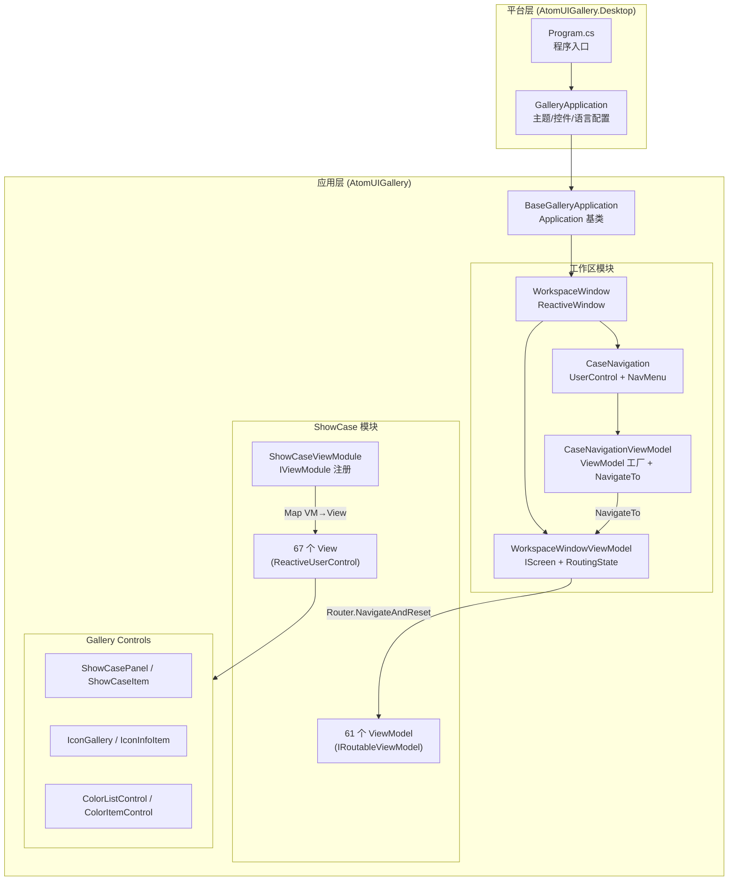
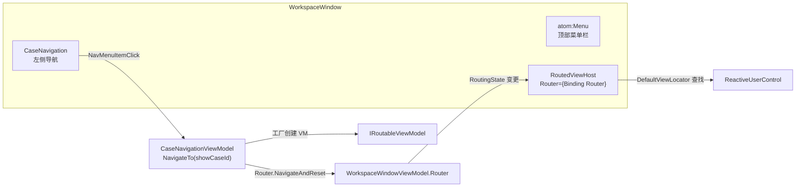
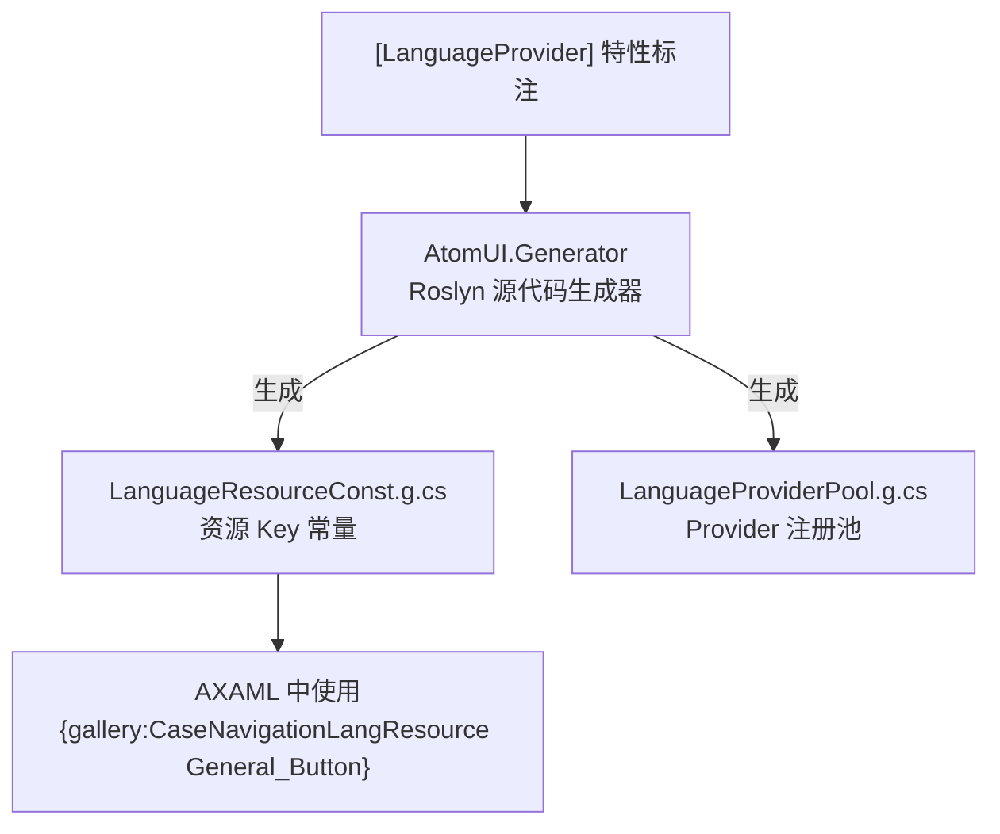
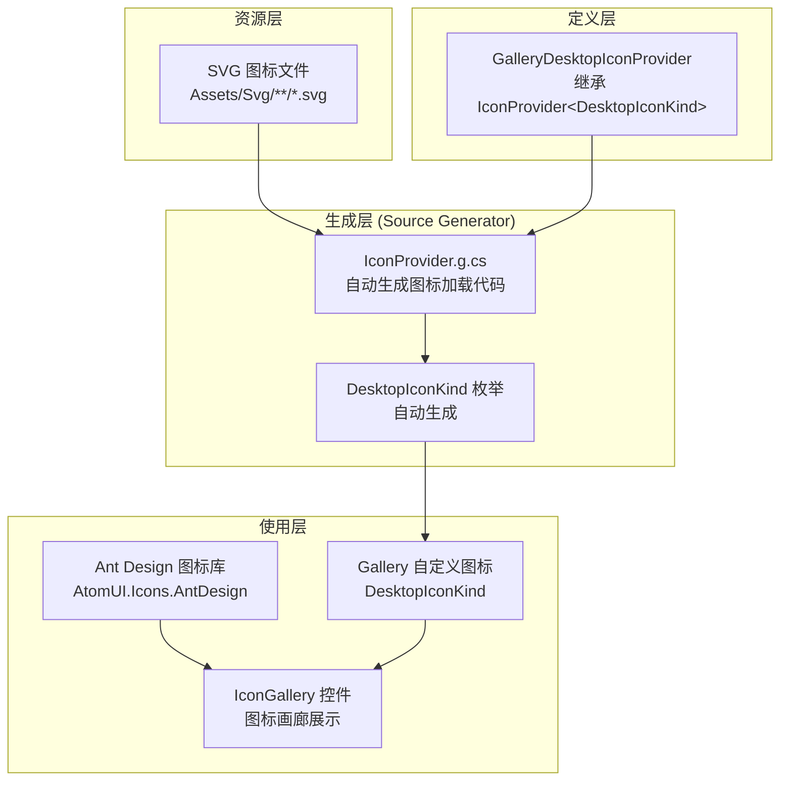
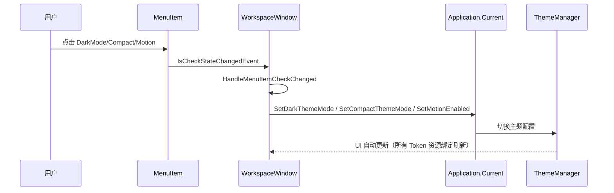
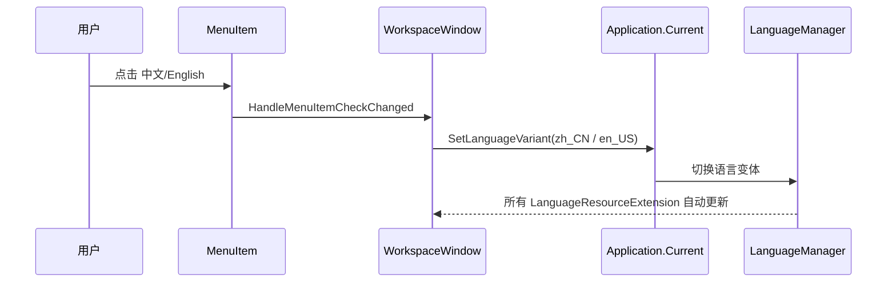

# AtomUI Gallery — 架构设计详解

> **文档版本**：2026-04-15

---

## 1. 整体架构

Gallery 采用 **ReactiveUI MVVM + 路由导航** 模式，整体由三层构成：



---

## 2. MVVM 架构

### 2.1 ReactiveUI 核心概念在 Gallery 中的应用

| ReactiveUI 概念 | Gallery 中的体现 |
|---|---|
| `IScreen` | `WorkspaceWindowViewModel` — 顶层路由宿主 |
| `RoutingState` | `WorkspaceWindowViewModel.Router` — 管理导航栈 |
| `IRoutableViewModel` | 所有 ShowCase ViewModel 都实现此接口 |
| `RoutedViewHost` | `WorkspaceWindow.axaml` 中的 `<rxui:RoutedViewHost>` — 根据当前路由显示对应 View |
| `IViewModule` + `DefaultViewLocator.Map<VM,V>()` | `ShowCaseViewModule.RegisterViews()` — AOT 兼容的显式 VM→View 映射 |
| `ReactiveWindow<T>` | `WorkspaceWindow : ReactiveWindow<WorkspaceWindowViewModel>` |
| `ReactiveUserControl<T>` | 所有 ShowCase View 都继承此基类 |
| `IActivatableViewModel` + `ViewModelActivator` | 部分 ViewModel 实现（用于激活/反激活生命周期） |
| `WhenActivated` | 所有 View 构造函数中调用 `this.WhenActivated(disposables => { ... })` |

### 2.2 ViewModel 基类模式

Gallery 中的 ViewModel 存在**两种模式**：

#### 模式 A：基础模式（仅路由，大多数 ViewModel 使用）

```csharp
public class SeparatorViewModel : ReactiveObject, IRoutableViewModel
{
    public static EntityKey ID = "Separator";          // 唯一标识
    public IScreen HostScreen { get; }                  // 路由宿主
    public string UrlPathSegment { get; } = ID.ToString(); // URL 片段
    
    public SeparatorViewModel(IScreen screen)
    {
        HostScreen = screen;
    }
}
```

#### 模式 B：带激活器模式（需要生命周期管理的 ViewModel）

```csharp
public class ButtonViewModel : ReactiveObject, IRoutableViewModel, IActivatableViewModel
{
    public static EntityKey ID = "Button";
    public IScreen HostScreen { get; }
    public ViewModelActivator Activator { get; }       // 激活器
    public string UrlPathSegment { get; } = ID.ToString();
    
    // 响应式属性
    private SizeType _buttonSizeType;
    public SizeType ButtonSizeType
    {
        get => _buttonSizeType;
        set => this.RaiseAndSetIfChanged(ref _buttonSizeType, value);
    }
    
    public ButtonViewModel(IScreen screen)
    {
        Activator  = new ViewModelActivator();
        HostScreen = screen;
    }
}
```

### 2.3 View 基类模式

所有 ShowCase View 继承 `ReactiveUserControl<TViewModel>`:

```csharp
public partial class SeparatorShowCase : ReactiveUserControl<SeparatorViewModel>
{
    public SeparatorShowCase()
    {
        this.WhenActivated(disposables => { /* 激活时的逻辑 */ });
        InitializeComponent();
    }
}
```

---

## 3. 路由与导航机制

### 3.1 路由架构



### 3.2 导航流程详解

1. 用户点击左侧 `NavMenu` 中的某个菜单项
2. `CaseNavigation.HandleNavMenuItemClick()` 获取 `ItemKey`（= ViewModel 的 `EntityKey ID`）
3. 调用 `CaseNavigationViewModel.NavigateTo(showCaseId)`
4. `NavigateTo()` 从 `_showCaseViewModelFactories` 字典中获取工厂函数，创建新的 ViewModel 实例
5. 调用 `HostScreen.Router.NavigateAndReset.Execute(viewModel)` 执行导航
6. `RoutedViewHost` 检测到 `Router` 变更，通过 `DefaultViewLocator` 查找对应的 View
7. View 被实例化并显示

### 3.3 View 定位器（AOT 兼容）

`ShowCaseViewModule` 实现了 `IViewModule` 接口，通过 `DefaultViewLocator.Map<TViewModel, TView>()` 显式注册所有映射：

```csharp
public sealed class ShowCaseViewModule : IViewModule
{
    public void RegisterViews(DefaultViewLocator locator)
    {
        locator.Map<ButtonViewModel, ButtonShowCase>(() => new ButtonShowCase());
        locator.Map<AlertViewModel, AlertShowCase>(() => new AlertShowCase());
        // ... 共计 67 个映射
    }
}
```

在 `Program.cs` 中注册：
```csharp
AppBuilder.Configure<GalleryApplication>()
    .UseReactiveUI(build =>
        build.ConfigureViewLocator(locator => new ShowCaseViewModule().RegisterViews(locator)))
```

**关键特性**：
- ✅ AOT / NativeAOT 兼容（无反射扫描）
- ✅ 编译时类型安全
- ✅ 每次导航创建新 View 实例（通过 lambda 工厂）

### 3.4 防重复导航

`CaseNavigationViewModel.NavigateTo()` 内置了防重复逻辑：

```csharp
public void NavigateTo(EntityKey showCaseId)
{
    if (_currentShowCase is not null && _currentShowCase == showCaseId)
        return;  // 相同 ShowCase 不重复导航
    
    _currentShowCase = showCaseId;
    var viewModel = _showCaseViewModelFactories[showCaseId]();
    HostScreen.Router.NavigateAndReset.Execute(viewModel);
}
```

### 3.5 自动遍历测试

`CaseNavigationViewModel` 还提供了**自动逐页遍历**功能（F5 开始 / F6 停止）：

```csharp
public void TestNavigatePages(TimeSpan interval)  // F5 触发
public void StopTestNavigatePages()                // F6 触发
```

通过 `DispatcherTimer` 以 300ms 间隔依次遍历所有 ShowCase，用于性能和稳定性测试。

---

## 4. 主题系统

### 4.1 AtomUI 主题初始化

在 `GalleryApplication.Initialize()` 中：

```csharp
this.UseAtomUI(builder =>
{
    builder.WithDefaultLanguageVariant(LanguageVariant.zh_CN);   // 默认中文
    builder.WithDefaultTheme(IThemeManager.DEFAULT_THEME_ID);    // 默认主题
    builder.UseAlibabaSansFont();                                 // 阿里巴巴普惠体
    builder.UseDesktopControls();                                 // 桌面控件主题
    builder.UseGalleryControls();                                 // Gallery 专用控件主题
    builder.UseDesktopDataGrid();                                 // DataGrid 主题
    builder.UseDesktopColorPicker();                              // ColorPicker 主题
});
```

### 4.2 运行时主题切换

通过顶部 Menu 菜单项切换，在 `WorkspaceWindow.HandleMenuItemCheckChanged()` 中处理：

```csharp
application.SetDarkThemeMode(menuItem.IsChecked);    // 亮色/暗色
application.SetCompactThemeMode(menuItem.IsChecked);  // 紧凑模式
application.SetMotionEnabled(menuItem.IsChecked);     // 动效
application.SetWaveSpiritEnabled(menuItem.IsChecked); // 波浪动画
```

### 4.3 Gallery 控件主题注册

Gallery 自有的控件通过 `UseGalleryControls()` 扩展方法注册：

```csharp
themeManagerBuilder.AddControlThemesProvider(new GalleryControlThemesProvider());  // 6 个主题
themeManagerBuilder.AddControlThemesProvider(new ShowCaseControlsThemesProvider()); // Form 控件主题
```

`GalleryControlThemesProvider.axaml` 注册的主题：
- `ShowCaseItemTheme.axaml`
- `ShowCasePanelTheme.axaml`
- `ColorItemControlTheme.axaml`
- `ColorListControlTheme.axaml`
- `IconGalleryTheme.axaml`
- `IconInfoItemTheme.axaml`

---

## 5. 本地化系统

### 5.1 架构

Gallery 使用 AtomUI 的 `LanguageProvider` 系统实现本地化：



### 5.2 语言资源文件

| 模块 | 语言 ID | 资源文件 |
|---|---|---|
| CaseNavigation 导航菜单 | `CaseNavigation` | `en_US.cs`, `zh_CN.cs`（各 ~95 个字符串） |
| WorkspaceWindow 窗口菜单 | `WorkspaceWindow` | `en_US.cs`, `zh_CN.cs`（各 ~12 个字符串） |

### 5.3 语言资源使用方式

**在 AXAML 中**：
```xml
<atom:NavMenuNode Header="{gallery:CaseNavigationLangResource General_Button}" />
<atom:MenuItem Header="{gallery:WorkspaceWindowLangResource MenuItemDarkMode}" />
```

**在代码中**（通过源代码生成器生成的 `MarkupExtension`）：
- `CaseNavigationLangResource` 扩展
- `WorkspaceWindowLangResource` 扩展

### 5.4 运行时语言切换

```csharp
application.SetLanguageVariant(LanguageVariant.zh_CN);
application.SetLanguageVariant(LanguageVariant.en_US);
```

---

## 6. XAML 命名空间注册

在 `Properties/AssemblyInfo.cs` 中定义了自定义 XAML 命名空间：

```csharp
[assembly: XmlnsPrefix("https://atomui.net/oss-controls/gallery", "gallery")]
[assembly: XmlnsDefinition("https://atomui.net/oss-controls/gallery", "AtomUIGallery.Controls")]
[assembly: XmlnsDefinition("https://atomui.net/oss-controls/gallery", "AtomUIGallery.Models")]
[assembly: XmlnsDefinition("https://atomui.net/oss-controls/gallery", "AtomUIGallery")]
[assembly: XmlnsDefinition("https://atomui.net/oss-controls/gallery", "AtomUIGallery.ShowCases.Views")]
[assembly: XmlnsDefinition("https://atomui.net/oss-controls/gallery", "AtomUIGallery.ShowCases.ShowCaseControls")]
[assembly: XmlnsDefinition("https://atomui.net/oss-controls/gallery", "AtomUIGallery.Localization")]
```

在 AXAML 中通过 `xmlns:gallery="https://atomui.net/oss-controls/gallery"` 引用。

---

## 7. ShowCase 布局系统

### 7.1 ShowCasePanel

`ShowCasePanel` 是一个**自动双列网格布局面板**，所有 ShowCase 页面的内容都放在其中：

- 自动将子控件（`ShowCaseItem`）排列为 2 列网格
- 支持 `IsOccupyEntireRow=True` 独占整行
- 奇数个项目时自动添加一个 `IsFake=True` 的占位符
- 外层包裹 `atom:ScrollViewer`（竖向滚动）

### 7.2 ShowCaseItem

每个 ShowCase 区块：
- 上部：`Content` 内容（控件演示）
- 下部：`Separator` + `Title` + `Description`
- 外部：`Border`（圆角 8px，1px 边框）

---

## 8. Gallery Controls 模块

Gallery 为自身需求定义了 6 个自定义控件：

| 控件 | 用途 | 关键特性 |
|---|---|---|
| `ShowCasePanel` | ShowCase 双列网格布局 | 自动排列 + 占位符填充 |
| `ShowCaseItem` | 单个 ShowCase 区块 | Title/Description/IsOccupyEntireRow |
| `IconGallery` | 图标画廊 | 按 ThemeType 过滤 + 反射扫描缓存 |
| `IconInfoItem` | 单个图标展示 | IconName + Icon |
| `ColorListControl` | 调色板颜色列表 | 从 PresetPalettes 生成 10 色梯度 |
| `ColorItemControl` | 单个颜色色块 | ColorName + Hex |

所有控件遵循 AtomUI 控件模式：`.cs` + `Theme.axaml` 分离。

---

## 9. Icons 子项目

`AtomUIGallery.Icons.Desktop` 是一个独立的图标资源项目：

- 通过 `<AdditionalFiles Include="Assets/Svg/**/*.svg"/>` 提供 SVG 源
- `GalleryDesktopIconProvider` 继承 `IconProvider<DesktopIconKind>`
- 使用反射加载图标类型（类名与 `DesktopIconKind` 枚举值对应）
- 依赖 `AtomUI.Core`（Debug 模式 ProjectReference，Release 模式 PackageReference）

---

## 10. 图标系统架构

### 10.1 整体架构



### 10.2 Ant Design 图标库

Gallery 同时引用 `AtomUI.Icons.AntDesign` 包，提供 Ant Design 完整图标集：
- **Filled** — 填充图标
- **Outlined** — 线性图标
- **TwoTone** — 双色图标

在 AXAML 中通过 `antdicons:` 前缀引用：
```xml
<antdicons:LoadingOutlined />
<antdicons:CloseOutlined />
```

### 10.3 IconGallery 控件

`IconGallery` 控件用于在 IconShowCase 中展示所有图标：
- 按 `IconThemeType`（Filled/Outlined/TwoTone）过滤
- 内部使用 `CachedLoadedAssemblyTypeScanner` 反射扫描 + `FrozenSet` 缓存
- 每个图标项由 `IconInfoItem` 展示（Icon + IconName）

### 10.4 新增自定义图标步骤

1. 将 SVG 文件放入 `AtomUIGallery.Icons.Desktop/Assets/Svg/` 目录
2. 重新编译，Source Generator 自动生成 `DesktopIconKind` 枚举成员
3. 在 AXAML 或代码中通过新枚举值引用

---

## 11. 主题切换控制流



---

## 12. 语言切换控制流



---

## 13. 窗口行为属性表

`WorkspaceWindow` 继承自 AtomUI 的 `ReactiveWindow`（增强版窗口），提供以下窗口行为控制属性：

| 属性 | 类型 | 说明 | 菜单项 |
|---|---|---|---|
| `IsFullScreenCaptionButtonEnabled` | `bool` | 全屏按钮是否可用 | WindowOptions → Enable FullScreen |
| `IsPinCaptionButtonEnabled` | `bool` | 置顶按钮是否可用 | WindowOptions → Enable Pin |
| `CanMinimize` | `bool` | 是否允许最小化 | WindowOptions → Enable Minimize |
| `CanMaximize` | `bool` | 是否允许最大化 | WindowOptions → Enable Maximize |
| `IsMoveEnabled` | `bool` | 是否允许移动窗口 | WindowOptions → Enable Move |
| `CanResize` | `bool` | 是否允许调整窗口大小 | WindowOptions → Enable Resize |

### 联动逻辑

Motion 和 WaveSpirit 存在联动关系：
- 关闭 Motion 时，自动取消 WaveSpirit 的选中状态
- WaveSpirit 依赖 Motion 开启

---

## 14. WorkspaceWindowLang 资源清单

| 资源键 | 中文 | 英文 |
|--------|------|------|
| `MenuItemSettings` | 设置 | Settings |
| `MenuItemTheme` | 主题 | Theme |
| `MenuItemLanguage` | 语言 | Language |
| `MenuItemWindowOptions` | 窗口选项 | Window Options |
| `MenuItemEnableFullScreen` | 开启全屏 | Enable FullScreen |
| `MenuItemEnablePin` | 开启窗口固定 | Enable Pin |
| `MenuItemEnableMinimize` | 开启最小化 | Enable Minimize |
| `MenuItemEnableMaximize` | 开启最大化 | Enable Maximize |
| `MenuItemEnableMove` | 开启窗口移动 | Enable Move |
| `MenuItemEnableResize` | 开启窗口设置大小 | Enable Resize |
| `MenuItemDarkMode` | 暗黑模式 | Dark Mode |
| `MenuItemCompactMode` | 紧凑模式 | Compact Mode |
| `MenuItemEnableMotion` | 开启动效 | Enable Motion |
| `MenuItemEnableWaveSpirit` | 开启波浪动画 | Enable WaveSpirit |


