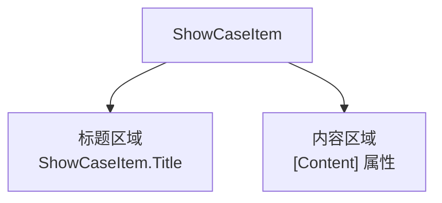

# ShowCase 体系详解

## 1. 概述

ShowCase 是 Gallery 的核心展示单元，每个 ShowCase 对应一个 AtomUI 控件的演示页面。当前共有 **72 个 ShowCase**，按功能分为 6 大类。

## 2. ShowCase 分类清单

### 2.1 General（通用）— 9 个

| ViewModel | View | 控件 |
|-----------|------|------|
| `AboutUsViewModel` | `AboutUsPage` | 关于页面（非控件） |
| `ButtonViewModel` | `ButtonShowCase` | Button 按钮 |
| `FloatButtonViewModel` | `FloatButtonShowCase` | FloatButton 悬浮按钮 |
| `SplitButtonViewModel` | `SplitButtonShowCase` | SplitButton 分割按钮 |
| `SeparatorViewModel` | `SeparatorShowCase` | Separator 分割线 |
| `IconViewModel` | `IconShowCase` | Icons 图标 |
| `PaletteViewModel` | `PaletteShowCase` | Palette 调色板 |
| `OsInfoViewModel` | `OsInfoPage` | 系统信息（非控件） |
| `CustomizeThemeViewModel` | `CustomizeThemeShowCase` | CustomizeTheme 主题定制 |

### 2.2 Layout（布局）— 5 个

| ViewModel | View | 控件 |
|-----------|------|------|
| `BoxPanelViewModel` | `BoxPanelShowCase` | BoxPanel 盒子布局（已废弃） |
| `FlexPanelViewModel` | `FlexPanelShowCase` | FlexPanel 弹性布局 |
| `GridViewModel` | `GridShowCase` | Grid 栅格布局 |
| `SpaceViewModel` | `SpaceShowCase` | Space 间距 |
| `SplitterViewModel` | `SplitterShowCase` | Splitter 分隔面板 |

### 2.3 Navigation（导航）— 8 个

| ViewModel | View | 控件 |
|-----------|------|------|
| `BreadcrumbViewModel` | `BreadcrumbShowCase` | Breadcrumb 面包屑 |
| `ComboBoxViewModel` | `ComboBoxShowCase` | ComboBox 组合框 |
| `DropdownButtonViewModel` | `DropdownButtonShowCase` | DropdownButton 下拉菜单 |
| `ButtonSpinnerViewModel` | `ButtonSpinnerShowCase` | ButtonSpinner 选项按钮 |
| `MenuViewModel` | `MenuShowCase` | Menu 菜单 |
| `PaginationViewModel` | `PaginationShowCase` | Pagination 分页 |
| `StepsViewModel` | `StepsShowCase` | Steps 步骤条 |
| `TabControlViewModel` | `TabControlShowCase` | TabControl 标签页 |

### 2.4 DataEntry（数据录入）— 18 个

| ViewModel | View | 控件 |
|-----------|------|------|
| `AutoCompleteViewModel` | `AutoCompleteShowCase` | AutoComplete 自动完成 |
| `CascaderViewModel` | `CascaderShowCase` | Cascader 级联选择 |
| `CheckBoxViewModel` | `CheckBoxShowCase` | CheckBox 多选框 |
| `ColorPickerViewModel` | `ColorPickerShowCase` | ColorPicker 颜色选择器 |
| `LineEditViewModel` | `LineEditShowCase` | LineEdit 输入框 |
| `DatePickerViewModel` | `DatePickerShowCase` | DatePicker 日期选择器 |
| `TimePickerViewModel` | `TimePickerShowCase` | TimePicker 时间选择器 |
| `FormViewModel` | `FormShowCase` | Form 表单 |
| `MentionsViewModel` | `MentionsShowCase` | Mentions 提及 |
| `NumberUpDownViewModel` | `NumberUpDownShowCase` | NumberUpDown 数字输入框 |
| `RadioButtonViewModel` | `RadioButtonShowCase` | RadioButton 单选框 |
| `RateViewModel` | `RateShowCase` | Rate 评分 |
| `ToggleSwitchViewModel` | `ToggleSwitchShowCase` | ToggleSwitch 开关 |
| `SelectViewModel` | `SelectShowCase` | Select 选择器 |
| `SliderViewModel` | `SliderShowCase` | Slider 滑动输入条 |
| `TransferViewModel` | `TransferShowCase` | Transfer 穿梭框 |
| `TreeSelectViewModel` | `TreeSelectShowCase` | TreeSelect 树选择 |
| `UploadViewModel` | `UploadShowCase` | Upload 上传 |

### 2.5 DataDisplay（数据展示）— 21 个

| ViewModel | View | 控件 |
|-----------|------|------|
| `AvatarViewModel` | `AvatarShowCase` | Avatar 头像 |
| `BadgeViewModel` | `BadgeShowCase` | Badge 徽标数 |
| `CalendarViewModel` | `CalendarShowCase` | Calendar 日历 |
| `CardViewModel` | `CardShowCase` | Card 卡片 |
| `CarouselViewModel` | `CarouselShowCase` | Carousel 走马灯 |
| `CollapseViewModel` | `CollapseShowCase` | Collapse 折叠面板 |
| `DescriptionsViewModel` | `DescriptionsShowCase` | Descriptions 描述列表 |
| `DataGridViewModel` | `DataGridShowCase` | DataGrid 数据表格 |
| `ExpanderViewModel` | `ExpanderShowCase` | Expander 展开面板 |
| `EmptyViewModel` | `EmptyShowCase` | Empty 空状态 |
| `ImagePreviewerViewModel` | `ImagePreviewerShowCase` | ImagePreviewer 图片预览 |
| `GroupBoxViewModel` | `GroupBoxShowCase` | GroupBox 分组盒 |
| `InfoFlyoutViewModel` | `InfoFlyoutShowCase` | InfoFlyout 信息提示 |
| `ListViewModel` | `ListShowCase` | List 列表 |
| `QRCodeViewModel` | `QRCodeShowCase` | QRCode 二维码 |
| `SegmentedViewModel` | `SegmentedShowCase` | Segmented 分段控制器 |
| `StatisticViewModel` | `StatisticShowCase` | Statistic 统计数值 |
| `TagViewModel` | `TagShowCase` | Tag 标签 |
| `TimelineViewModel` | `TimelineShowCase` | Timeline 时间轴 |
| `TreeViewViewModel` | `TreeViewShowCase` | TreeView 树形控件 |
| `TooltipViewModel` | `TooltipShowCase` | Tooltip 文字提示 |
| `TourViewModel` | `TourShowCase` | Tour 漫游式引导 |

### 2.6 Feedback（反馈）— 11 个

| ViewModel | View | 控件 |
|-----------|------|------|
| `AlertViewModel` | `AlertShowCase` | Alert 警告提示 |
| `DrawerViewModel` | `DrawerShowCase` | Drawer 抽屉 |
| `MessageViewModel` | `MessageShowCase` | Message 全局提示 |
| `ModalViewModel` | `ModalShowCase` | Modal 对话框 |
| `NotificationViewModel` | `NotificationShowCase` | Notification 通知提醒框 |
| `PopupConfirmViewModel` | `PopupConfirmShowCase` | PopupConfirm 气泡确定框 |
| `ProgressBarViewModel` | `ProgressBarShowCase` | ProgressBar 进度条 |
| `ResultViewModel` | `ResultShowCase` | Result 结果 |
| `SkeletonViewModel` | `SkeletonShowCase` | Skeleton 骨架屏 |
| `SpinViewModel` | `SpinShowCase` | Spin 加载提示 |
| `WatermarkViewModel` | `WatermarkShowCase` | Watermark 水印 |

## 3. ViewModel/View 对应关系

### 3.1 命名约定

| 层 | 命名模式 | 示例 |
|----|---------|------|
| ViewModel | `{ControlName}ViewModel` | `ButtonViewModel` |
| View (ShowCase) | `{ControlName}ShowCase` | `ButtonShowCase` |
| View (Page) | `{ControlName}Page` | `AboutUsPage`, `OsInfoPage` |
| ViewModel ID | `EntityKey` 静态字段 | `ButtonViewModel.ID = "Button"` |

> **注意**：`AboutUsPage` 和 `OsInfoPage` 使用 `Page` 后缀而非 `ShowCase`，因为它们是信息页面而非控件演示。

### 3.2 文件组织

```
ShowCases/
├── ViewModels/
│   └── {Category}/           # 按功能分类
│       └── {ControlName}ViewModel.cs
└── Views/
    └── {Category}/           # 按功能分类（与 ViewModel 对应）
        ├── {ControlName}ShowCase.axaml      # XAML 布局
        └── {ControlName}ShowCase.axaml.cs   # 代码逻辑
```

## 4. 路由注册机制

### 4.1 注册流程

所有 ShowCase ViewModel 在 `CaseNavigationViewModel` 构造函数中通过 Service Locator 注册：

```csharp
// CaseNavigationViewModel 构造函数中的注册模式
Locator.CurrentMutable.Register(() => new ButtonViewModel(screen), 
    typeof(IRoutableViewModel), ButtonViewModel.ID.ToString());
```

每个注册项包含：
- **工厂 Lambda**：`() => new XxxViewModel(screen)` — 延迟创建 ViewModel
- **注册类型**：`typeof(IRoutableViewModel)` — 统一注册为可路由 ViewModel
- **服务 Key**：`XxxViewModel.ID.ToString()` — 用 EntityKey 字符串作为唯一标识

### 4.2 导航解析

```csharp
// NavigateTo 方法
public void NavigateTo(string showCaseId)
{
    var viewModel = Locator.Current.GetService<IRoutableViewModel>(showCaseId);
    if (viewModel != null)
    {
        Router.NavigateAndReset.Execute(viewModel);
    }
}
```

### 4.3 View 自动解析

ReactiveUI 通过 `IViewFor<T>` 接口和 `RoutedViewHost` 自动将 ViewModel 映射到 View：
- `ButtonViewModel` → `ButtonShowCase`（因为 `ButtonShowCase : ReactiveUserControl<ButtonViewModel>`）
- `WorkspaceWindowViewModel` → `WorkspaceWindow`（因为 `WorkspaceWindow : ReactiveWindow<WorkspaceWindowViewModel>`）

## 5. ShowCase View 基类模式

### 5.1 ReactiveUserControl<T>

所有 ShowCase View 继承自 `ReactiveUserControl<XxxViewModel>`：

```csharp
public partial class ButtonShowCase : ReactiveUserControl<ButtonViewModel>
{
    private ButtonViewModel? _viewModel;
    
    public ButtonShowCase()
    {
        this.WhenActivated(disposables =>
        {
            _viewModel = DataContext as ButtonViewModel;
        });
        InitializeComponent();
    }
}
```

### 5.2 WhenActivated 生命周期

`WhenActivated` 是 ReactiveUI 提供的生命周期钩子，在 View 被激活时调用：

- **用途**：获取 ViewModel 引用、设置订阅、执行初始化逻辑
- **参数**：`disposables` — `CompositeDisposable`，用于管理订阅生命周期
- **时机**：View 被添加到可视化树后触发
- **配对**：与 `IActivatableViewModel` 接口配合使用

### 5.3 事件处理模式

ShowCase View 中的事件处理有两种模式：

**模式 1：Code-Behind 事件处理**（当前主流）

```csharp
// 在 axaml 中绑定事件
// <Button Click="HandleLoadingBtnClick"/>
public void HandleLoadingBtnClick(object? sender, RoutedEventArgs args)
{
    if (sender is Button button)
    {
        button.IsLoading = true;
        Dispatcher.UIThread.InvokeAsync(async () =>
        {
            await Task.Delay(TimeSpan.FromSeconds(3));
            button.IsLoading = false;
        });
    }
}
```

**模式 2：ViewModel 属性绑定**（部分使用）

```csharp
// ViewModel 中的响应式属性
private SizeType _buttonSizeType;
public SizeType ButtonSizeType
{
    get => _buttonSizeType;
    set => this.RaiseAndSetIfChanged(ref _buttonSizeType, value);
}

// View 中通过 DataContext 访问
_viewModel.ButtonSizeType = SizeType.Large;
```

## 6. ShowCasePanel 布局系统

### 6.1 布局规则

`ShowCasePanel` 是 ShowCase 页面的核心布局容器：

- **2 列 Grid 布局**：默认每行放置 2 个 `ShowCaseItem`
- **整行占位**：`ShowCaseItem.IsOccupyEntireRow = true` 时独占一行
- **自动补齐**：奇数个 Item 时自动添加一个 `IsFake=true` 的占位项

### 6.2 ShowCaseItem 结构



- `Title` — 展示项标题（如 "基本用法"、"不同尺寸"）
- `[Content]` — 展示项内容（Avalonia `Content` 属性）
- `IsOccupyEntireRow` — 是否独占整行
- `IsFake` — 是否为自动补齐的占位项

### 6.3 ShowCasePanel 生命周期通知

`ShowCasePanel` 提供了 4 个生命周期虚方法，供子类覆写：

| 方法 | 触发时机 |
|------|---------|
| `NotifyAboutToActive()` | 即将激活 |
| `NotifyActivated()` | 已激活 |
| `NotifyAboutToDeactivated()` | 即将停用 |
| `NotifyDeactivated()` | 已停用 |

## 7. 新增 ShowCase 步骤

要为一个新的 AtomUI 控件添加 ShowCase，需要以下步骤：

### 步骤 1：创建 ViewModel

在 `ShowCases/ViewModels/{Category}/` 下创建：

```csharp
using AtomUI;
using ReactiveUI;

namespace AtomUIGallery.ShowCases.ViewModels;

public class NewControlViewModel : ReactiveObject, IRoutableViewModel, IActivatableViewModel
{
    public static EntityKey ID = "NewControl";
    
    public IScreen HostScreen { get; }
    public ViewModelActivator Activator { get; }
    public string UrlPathSegment { get; } = ID.ToString();

    public NewControlViewModel(IScreen screen)
    {
        Activator  = new ViewModelActivator();
        HostScreen = screen;
    }
}
```

### 步骤 2：创建 View

在 `ShowCases/Views/{Category}/` 下创建：

**NewControlShowCase.axaml：**
```xml
<rxui:ReactiveUserControl xmlns="https://github.com/avaloniaui"
                          xmlns:x="http://schemas.microsoft.com/winfx/2006/xaml"
                          xmlns:rxui="clr-namespace:ReactiveUI.Avalonia;assembly=ReactiveUI.Avalonia"
                          xmlns:vm="clr-namespace:AtomUIGallery.ShowCases.ViewModels"
                          x:TypeArguments="vm:NewControlViewModel"
                          x:Class="AtomUIGallery.ShowCases.Views.NewControlShowCase">
    <!-- ShowCase 内容 -->
</rxui:ReactiveUserControl>
```

**NewControlShowCase.axaml.cs：**
```csharp
using AtomUIGallery.ShowCases.ViewModels;
using ReactiveUI;

namespace AtomUIGallery.ShowCases.Views;

public partial class NewControlShowCase : ReactiveUserControl<NewControlViewModel>
{
    public NewControlShowCase()
    {
        this.WhenActivated(disposables => { });
        InitializeComponent();
    }
}
```

### 步骤 3：注册路由

在 `CaseNavigationViewModel` 构造函数中添加注册：

```csharp
Locator.CurrentMutable.Register(() => new NewControlViewModel(screen), 
    typeof(IRoutableViewModel), NewControlViewModel.ID.ToString());
```

### 步骤 4：添加导航项

在 `CaseNavigation.axaml` 的 `NavMenu` 中添加导航项。

### 步骤 5：添加国际化资源

在 `Workspace/Localization/CaseNavigationLang/` 的 `zh_CN.cs` 和 `en_US.cs` 中添加对应的导航文本。

### 步骤 6：更新语言资源枚举

Source Generator 会自动扫描 `LanguageProvider` 子类并生成 `CaseNavigationLangResourceKind` 枚举，但需要确保新增的 `const string` 字段名与枚举成员对应。

## 8. 测试导航功能

Gallery 内置了自动测试导航功能：

- **F5** — 启动自动导航测试，每隔 300ms 自动切换到下一个 ShowCase
- **F6** — 停止自动导航测试

这是通过 `CaseNavigation.OnGlobalKeyDown` 和 `CaseNavigationViewModel.TestNavigatePages/StopTestNavigatePages` 实现的。