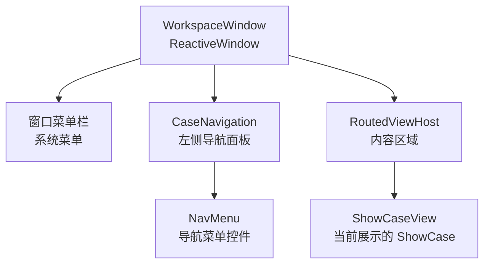

# Workspace 窗口系统

## 1. 概述

Workspace 是 Gallery 的主窗口系统，包含窗口框架、导航面板和内容区域。它负责管理整体布局、主题切换、语言切换和窗口行为控制。

## 2. 核心组件

### 2.1 WorkspaceWindowViewModel

```csharp
public class WorkspaceWindowViewModel : ReactiveObject, IScreen
{
    public RoutingState Router { get; } = new RoutingState();
}
```

- 实现 `IScreen` 接口，作为 ReactiveUI 路由的宿主
- 持有 `RoutingState` 实例，管理导航堆栈
- 极简设计，仅负责路由管理

### 2.2 WorkspaceWindow

```csharp
public partial class WorkspaceWindow : ReactiveWindow<WorkspaceWindowViewModel>
```

主窗口，继承自 `ReactiveWindow<WorkspaceWindowViewModel>`，职责包括：

1. **初始化**：创建 ViewModel、初始化组件、注册事件处理器
2. **菜单事件处理**：统一处理所有菜单项的选中状态变更
3. **窗口行为控制**：全屏、置顶、最小化、最大化、移动、调整大小
4. **主题切换**：暗色模式、紧凑模式、动效、波纹
5. **语言切换**：中文/英文

### 2.3 CaseNavigationViewModel

导航面板的 ViewModel，核心职责：

1. **注册所有 ShowCase 工厂**：在构造函数中通过 `Locator.CurrentMutable.Register` 注册 72 个 ViewModel
2. **执行导航**：`NavigateTo(showCaseId)` 方法
3. **自动测试导航**：`TestNavigatePages` / `StopTestNavigatePages`

### 2.4 CaseNavigation

导航面板 View，核心职责：

1. **处理导航点击**：监听 `NavMenu.NavMenuItemClick` 事件
2. **查找 IScreen**：在 `OnAttachedToLogicalTree` 中向上遍历可视化树找到 `IScreen`
3. **默认导航**：首次附加时导航到 `AboutUsViewModel.ID`
4. **全局快捷键**：F5/F6 自动测试导航

## 3. 窗口布局结构



## 4. 菜单系统

### 4.1 菜单项定义

WorkspaceWindow 通过 `WindowMenuItemKind` 枚举定义菜单项：

| 枚举值 | 功能 | 操作 |
|--------|------|------|
| `FullScreen` | 全屏 | `IsFullScreenCaptionButtonEnabled` |
| `Pin` | 置顶 | `IsPinCaptionButtonEnabled` |
| `Minimize` | 允许最小化 | `CanMinimize` |
| `Maximize` | 允许最大化 | `CanMaximize` |
| `Move` | 允许移动 | `IsMoveEnabled` |
| `Resize` | 允许调整大小 | `CanResize` |
| `DarkMode` | 暗色模式 | `Application.SetDarkThemeMode()` |
| `Compact` | 紧凑模式 | `Application.SetCompactThemeMode()` |
| `Motion` | 动效开关 | `Application.SetMotionEnabled()` |
| `WaveSpirit` | 波纹开关 | `Application.SetWaveSpiritEnabled()` |
| `LanguageZhCN` | 中文 | `Application.SetLanguageVariant(zh_CN)` |
| `LanguageEnUS` | 英文 | `Application.SetLanguageVariant(en_US)` |

### 4.2 事件处理机制

所有菜单项使用统一的事件处理模式：

```csharp
AddHandler(MenuItem.IsCheckStateChangedEvent, HandleMenuItemCheckChanged);
```

通过 `MenuItem.Tag` 属性存储 `WindowMenuItemKind` 枚举值来区分不同菜单项。

### 4.3 联动逻辑

Motion 和 WaveSpirit 存在联动关系：
- 关闭 Motion 时，自动取消 WaveSpirit 的选中状态
- WaveSpirit 依赖 Motion 开启

## 5. 窗口行为控制

WorkspaceWindow 继承自 AtomUI 的窗口控件（非标准 Avalonia Window），提供以下增强功能：

| 属性 | 说明 |
|------|------|
| `IsFullScreenCaptionButtonEnabled` | 全屏按钮是否可用 |
| `IsPinCaptionButtonEnabled` | 置顶按钮是否可用 |
| `CanMinimize` | 是否允许最小化 |
| `CanMaximize` | 是否允许最大化 |
| `IsMoveEnabled` | 是否允许移动窗口 |
| `CanResize` | 是否允许调整窗口大小 |

## 6. 线程安全

主题和语言切换操作通过 `Dispatcher.UIThread.Post()` 确保在 UI 线程执行：

```csharp
Dispatcher.UIThread.Post(() =>
{
    application.SetDarkThemeMode(menuItem.IsChecked);
});
```

窗口行为属性（如 `CanMinimize`）直接设置，因为事件本身就在 UI 线程触发。

## 7. DevTools 集成

Debug 模式下自动附加 Avalonia DevTools：

```csharp
#if DEBUG
    this.AttachDevTools();
#endif
```

按 F12 可打开 DevTools 检查可视化树和属性。