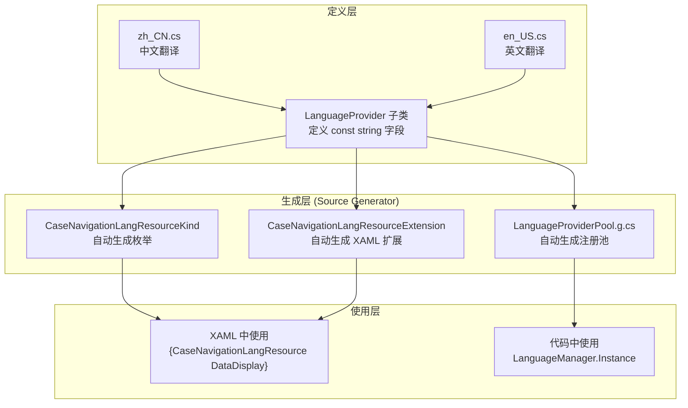

# 国际化系统

## 1. 概述

Gallery 使用 AtomUI 自研的国际化系统，基于 `LanguageProvider` + Source Generator 实现。支持中文（zh_CN）和英文（en_US）两种语言，运行时动态切换。

## 2. 架构



## 3. LanguageProvider 定义模式

每个需要国际化的模块定义一个 `LanguageProvider` 子类：

```csharp
// Workspace/Localization/CaseNavigationLang/zh_CN.cs
[LanguageProvider("CaseNavigation")]
public class CaseNavigationZhCN : AbstractLanguageProvider
{
    public const string General = "通用";
    public const string General_Button = "按钮 Button";
    public const string DataDisplay = "数据展示";
    // ...
}
```

```csharp
// Workspace/Localization/CaseNavigationLang/en_US.cs
[LanguageProvider("CaseNavigation")]
public class CaseNavigationEnUS : AbstractLanguageProvider
{
    public const string General = "General";
    public const string General_Button = "Button";
    public const string DataDisplay = "Data Display";
    // ...
}
```

### 关键规则

1. **`[LanguageProvider("Name")]`** — 标记类为语言提供者，参数为提供者名称
2. **同一名称的多个类** — 对应不同语言变体（zh_CN / en_US）
3. **`const string` 字段** — 字段名作为资源键，字段值作为翻译文本
4. **字段名必须一致** — 不同语言类中相同含义的字段名必须完全相同

## 4. Source Generator 生成内容

### 4.1 LanguageResourceConst.g.cs

自动生成枚举和 XAML 扩展标记：

```csharp
// 自动生成
public enum CaseNavigationLangResourceKind
{
    DataDisplay,
    DataDisplay_Avatar,
    DataDisplay_Badge,
    // ... 所有 const string 字段名
    General,
    General_Button,
    // ...
}

public class CaseNavigationLangResourceExtension : LanguageResourceExtension<CaseNavigationLangResourceKind>
{
    // XAML 标记扩展，用于在 XAML 中引用国际化文本
}
```

### 4.2 LanguageProviderPool.g.cs

自动生成语言提供者注册池，在应用启动时自动注册所有语言提供者。

## 5. XAML 中使用

```xml
<!-- 使用生成的 XAML 扩展 -->
<NavMenuItem Header="{CaseNavigationLangResource General_Button}" 
             ItemKey="{x:Static vm:ButtonViewModel.ID}"/>
```

## 6. 语言切换

通过 `Application.Current.SetLanguageVariant()` 切换语言：

```csharp
// 切换到中文
Application.Current.SetLanguageVariant(LanguageVariant.zh_CN);

// 切换到英文
Application.Current.SetLanguageVariant(LanguageVariant.en_US);
```

切换后，所有使用 `LanguageResourceExtension` 的绑定会自动更新。

## 7. 当前国际化模块

| 模块 | LanguageProvider 名称 | 文件位置 |
|------|----------------------|---------|
| 导航面板 | `CaseNavigation` | `Workspace/Localization/CaseNavigationLang/` |
| 窗口菜单 | `WorkspaceWindow` | `Workspace/Localization/WorkspaceWindowLang/` |

## 8. 新增国际化资源步骤

1. 在对应模块的 `Localization/` 目录下创建 `zh_CN.cs` 和 `en_US.cs`
2. 两个文件中定义相同名称的 `const string` 字段
3. 使用 `[LanguageProvider("ModuleName")]` 标记类
4. Source Generator 自动生成枚举和 XAML 扩展
5. 在 XAML 中使用 `{ModuleNameLangResource FieldName}` 引用

## 9. WorkspaceWindowLang 资源清单

| 资源键 | 中文 | 英文 |
|--------|------|------|
| `MenuItemCompactMode` | 紧凑模式 | Compact Mode |
| `MenuItemDarkMode` | 暗色模式 | Dark Mode |
| `MenuItemEnableFullScreen` | 允许全屏 | Enable Full Screen |
| `MenuItemEnableMaximize` | 允许最大化 | Enable Maximize |
| `MenuItemEnableMinimize` | 允许最小化 | Enable Minimize |
| `MenuItemEnableMotion` | 启用动效 | Enable Motion |
| `MenuItemEnableMove` | 允许移动 | Enable Move |
| `MenuItemEnablePin` | 允许置顶 | Enable Pin |
| `MenuItemEnableResize` | 允许调整大小 | Enable Resize |
| `MenuItemEnableWaveSpirit` | 启用波纹 | Enable Wave Spirit |
| `MenuItemLanguage` | 语言 | Language |
| `MenuItemSettings` | 设置 | Settings |
| `MenuItemTheme` | 主题 | Theme |
| `MenuItemWindowOptions` | 窗口选项 | Window Options |