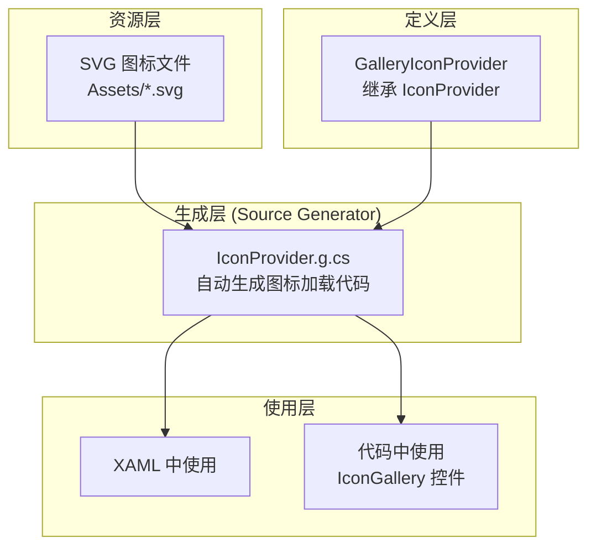
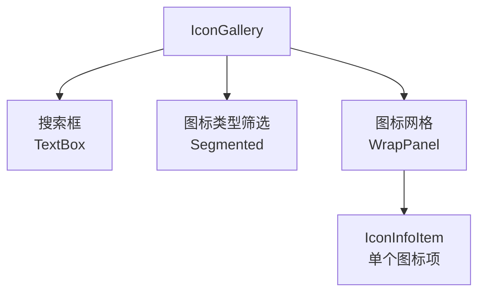

# 图标系统

## 1. 概述

Gallery 使用 AtomUI 的图标系统，基于 `IconProvider` + Source Generator 实现。图标资源以 SVG 文件形式存储，通过 Source Generator 自动生成强类型的图标提供者代码。

## 2. 架构



## 3. AtomUIGallery.Icons.Desktop 项目

### 3.1 项目职责

独立的图标资源项目，包含 Gallery 自定义的图标（非 Ant Design 图标库中的图标）。

### 3.2 项目文件

```xml
<Project Sdk="Microsoft.NET.Sdk">
    <PropertyGroup>
        <TargetFrameworks>$(AtomUITargetFrameworks)</TargetFrameworks>
        <Nullable>enable</Nullable>
        <EmitCompilerGeneratedFiles>true</EmitCompilerGeneratedFiles>
        <CompilerGeneratedFilesOutputPath>GeneratedFiles</CompilerGeneratedFilesOutputPath>
    </PropertyGroup>
    
    <!-- Debug: ProjectReference / Release: PackageReference -->
    <ItemGroup Condition=" '$(Configuration)' == 'Debug' ">
        <ProjectReference Include="../../src/AtomUI.Icons.AntDesign/AtomUI.Icons.AntDesign.csproj"/>
        <ProjectReference Include="../../src/AtomUI.Icons.Shared/AtomUI.Icons.Shared.csproj"/>
        <ProjectReference Include="../../src/AtomUI.Generator/AtomUI.Generator.csproj"
                          OutputItemType="Analyzer" ReferenceOutputAssembly="false" PrivateAssets="all"/>
    </ItemGroup>
    
    <ItemGroup>
        <PackageReference Include="AtomUI.Icons.AntDesign"/>
        <PackageReference Include="AtomUI.Icons.Shared"/>
    </ItemGroup>
</Project>
```

### 3.3 GalleryIconProvider

```csharp
[IconProvider("GalleryDesktop")]
public class GalleryIconProvider : IconProvider<DesktopIconKind>
{
    // Source Generator 自动生成图标加载逻辑
    // 扫描 Assets/ 目录下的 SVG 文件
    // 生成 DesktopIconKind 枚举和图标数据
}
```

- 继承 `IconProvider<DesktopIconKind>`，泛型参数为图标种类枚举
- 使用 `[IconProvider("GalleryDesktop")]` 标记
- Source Generator 扫描 `Assets/` 目录下的 SVG 文件，自动生成枚举成员和加载代码

## 4. Ant Design 图标库

Gallery 同时引用了 `AtomUI.Icons.AntDesign` 包，提供 Ant Design 完整图标库：

- **填充图标**（Filled）
- **线性图标**（Outlined）  
- **双色图标**（TwoTone）

这些图标通过 `AntDesignIconKind` 枚举引用。

## 5. IconGallery 控件

Gallery 自定义了 `IconGallery` 控件，用于在 IconShowCase 中展示所有图标：

### 5.1 控件结构



### 5.2 IconInfoItem

每个图标项显示：
- 图标本身（`Icon` 控件）
- 图标名称（`TextBlock`）
- 点击复制图标名称到剪贴板

## 6. 图标使用方式

### 6.1 XAML 中使用

```xml
<!-- 使用 Ant Design 图标 -->
<Icon Value="{x:Static icons:AntDesignIconKind.SearchOutlined}"/>

<!-- 使用 Gallery 自定义图标 -->
<Icon Value="{x:Static icons:DesktopIconKind.CustomIcon}"/>
```

### 6.2 代码中使用

```csharp
var icon = new Icon();
icon.Value = AntDesignIconKind.SearchOutlined;
```

## 7. 新增自定义图标步骤

1. 将 SVG 文件放入 `AtomUIGallery.Icons.Desktop/Assets/` 目录
2. SVG 文件名遵循 `{IconName}.svg` 命名规范
3. Source Generator 自动扫描并生成 `DesktopIconKind` 枚举成员
4. 重新编译项目
5. 在 XAML 或代码中使用新的 `DesktopIconKind.Xxx` 引用

## 8. Source Generator 生成文件

### IconProvider.g.cs

Source Generator 为每个 `[IconProvider]` 标记的类生成：

1. **图标种类枚举** — 每个 SVG 文件对应一个枚举成员
2. **图标数据加载** — 从嵌入资源加载 SVG 数据
3. **图标查找方法** — 根据枚举值获取对应的图标数据