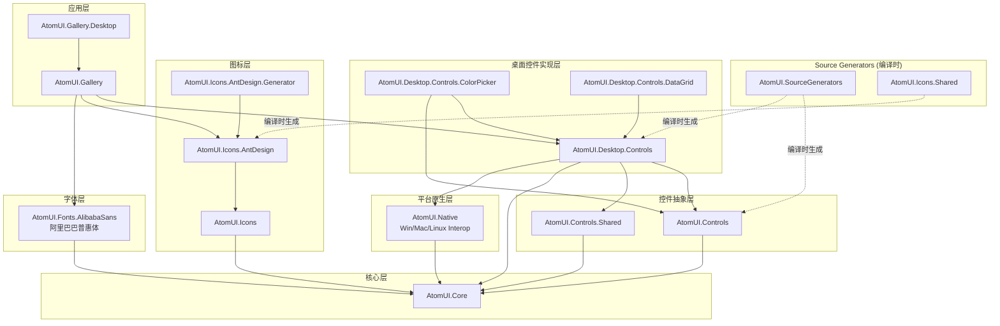
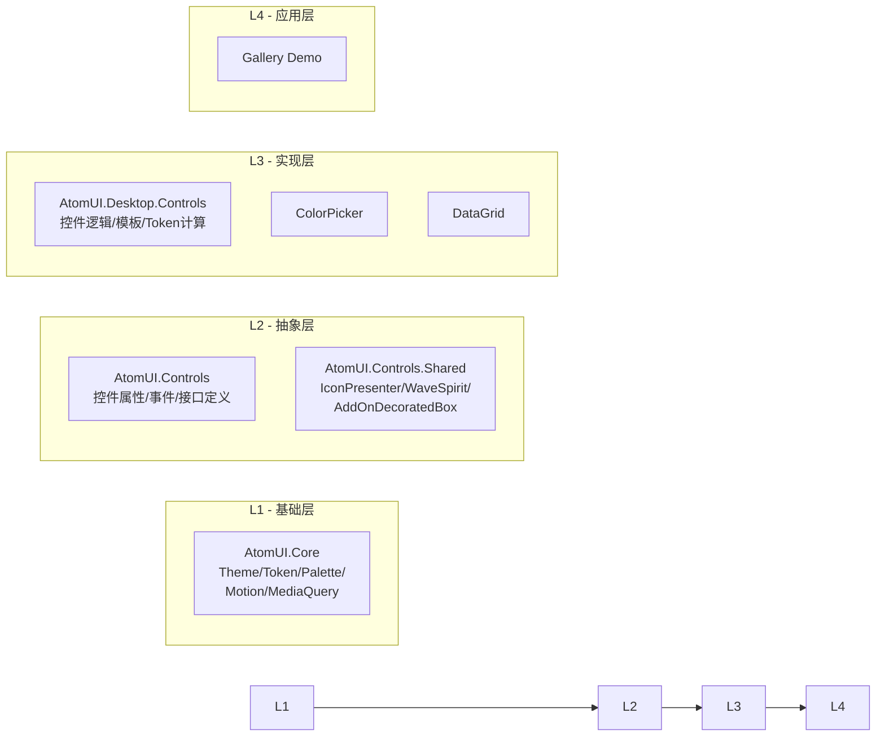
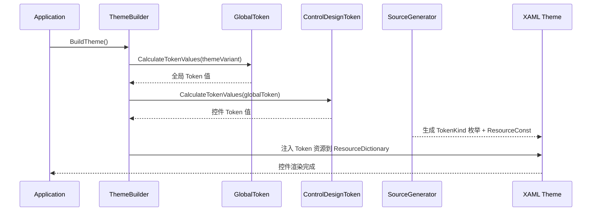
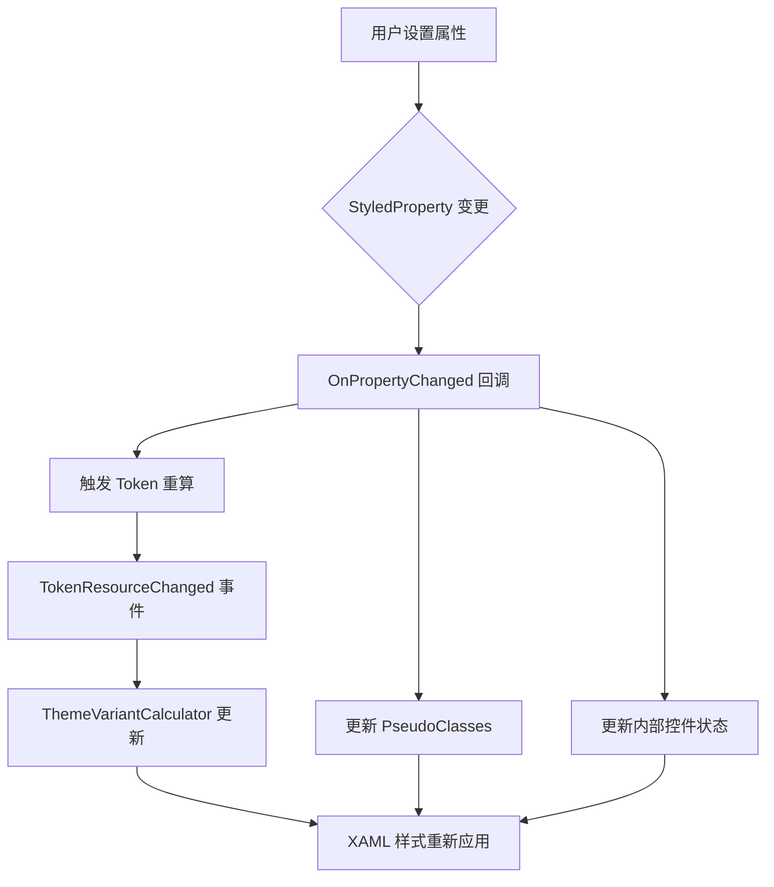

# 02 - 架构设计

## 模块划分与依赖关系

### 项目依赖图



### 分层架构图



## 核心数据流

### 主题初始化流程



### 控件 Token 计算流程

```mermaid
flowchart TD
    A[GlobalToken] -->|Seed Tokens| B[ControlDesignToken._globalToken]
    B --> C{CalculateTokenValues}
    C --> D[计算共享 Token]
    D --> E[计算 SizeType 变体]
    E --> F[计算 StyleVariant 变体]
    F --> G[标记 TokenResourceKey 属性]
    G --> H[Source Generator 扫描]
    H --> I[生成 TokenKind 枚举]
    H --> J[生成 TokenResourceConst 映射]
    I --> K[XAML 引用: {atom:ControlTokenResource Key}]
    J --> K
```

### 控件属性变更流



## 命名空间结构

| 项目 | 根命名空间 | 关键子命名空间 |
|------|-----------|---------------|
| AtomUI.Core | `AtomUI.Core` | `.Theme`, `.Theme.TokenSystem`, `.Theme.Palette`, `.Theme.Styling`, `.Animations`, `.MediaQuery` |
| AtomUI.Controls | `AtomUI.Controls` | `.{ControlName}` (每个控件一个) |
| AtomUI.Controls.Shared | `AtomUI.Controls.Shared` | `.IconPresenter`, `.WaveSpirit`, `.AddOnDecoratedBox`, `.Data`, `.Utils` |
| AtomUI.Desktop.Controls | `AtomUI.Controls` | `.{ControlName}` (与Controls相同命名空间) |
| AtomUI.Icons | `AtomUI.Icons` | `.AntDesign` |
| AtomUI.Native | `AtomUI.Native` | `.Windows`, `.MacOS`, `.Linux` |
| AtomUI.Fonts.AlibabaSans | `AtomUI.Fonts.AlibabaSans` | (无子命名空间) |
| AtomUI.SourceGenerators | `AtomUI.SourceGenerators` | `.Token`, `.Theme` |

## 核心类职责

### AtomUI.Core 核心类

| 类名 | 职责 | 关键方法 |
|------|------|----------|
| `ThemeBuilder` | 主题构建入口 | `BuildTheme()`, `BuildLightTheme()`, `BuildDarkTheme()` |
| `GlobalToken` | 全局设计令牌 | `CalculateTokenValues()`, 80+ 种子属性 |
| `AbstractDesignToken` | Token 抽象基类 | `IDesignToken` 接口实现 |
| `AbstractControlDesignToken` | 控件 Token 基类 | `CalculateTokenValues()`, `TokenResourceChanged` |
| `ThemeVariantCalculator` | 主题变体计算器 | 管理亮/暗主题切换 |
| `ColorPalette` | 颜色算法 | Ant Design 色板生成算法 |
| `MotionConfig` | 动画配置 | 缓动函数、时长常量 |

### AtomUI.Controls.Shared 核心类

| 类名 | 职责 |
|------|------|
| `IconPresenter` | 图标渲染器，支持 PathIcon/Bitmap 缩放 |
| `AddOnDecoratedBox` | 输入控件装饰器（前缀/后缀） |
| `WaveSpirit` | 水波纹点击效果 |
| `AbstractWavePainter` | 波纹绘制抽象 |
| `ListCollectionView` | 列表集合视图（分组/排序/过滤） |
| `MediaQueryManager` | 响应式媒体查询管理器 |

### AtomUI.Native 核心类（平台原生互操作）

`AtomUI.Native` 提供跨平台的原生窗口操作能力，使用 `partial class` 按平台拆分实现。项目标记 `AllowUnsafeBlocks`，内部类通过 `InternalsVisibleTo` 暴露给 `AtomUI.Core` 和 `AtomUI.Desktop.Controls`。

| 类名 | 职责 | 平台 |
|------|------|------|
| `WindowExtensions` | 窗口扩展方法（跨平台分发） | 全平台 |
| `WindowUtilsInterop` (Windows) | Win32 API P/Invoke 声明 | Windows |
| `WindowUtilsInterop` (macOS) | Objective-C Runtime P/Invoke 声明 | macOS |
| `WindowUtilsInterop` (Linux) | XCB/X11 Shape Extension P/Invoke 声明 | Linux |

**核心功能**:

| 功能 | Windows 实现 | macOS 实现 | Linux 实现 |
|------|-------------|-----------|-----------|
| 鼠标事件穿透 | `WS_EX_TRANSPARENT` + `WS_EX_LAYERED` | `setIgnoresMouseEvents:` | XCB Shape Extension |
| 窗口按钮位置 | — | `standardWindowButton:` + `setFrame:` | — |
| 窗口可关闭控制 | — | `setEnabled:` on CloseButton | — |

**技术要点**:
- Windows: 使用 `user32.dll` 的 `GetWindowLong`/`SetWindowLong` 操作窗口扩展样式
- macOS: 使用 `libobjc.A.dylib` 的 `objc_msgSend` 调用 Objective-C 运行时
- Linux: 使用 XCB 协议的 Shape Extension 控制窗口输入区域
- 所有平台方法标记 `[SupportedOSPlatform]` 属性确保平台安全

### AtomUI.Fonts.AlibabaSans（阿里巴巴普惠体）

| 类名 | 职责 |
|------|------|
| `AlibabaSansFontCollection` | 字体集合注册，将 TTF 字体注入 Avalonia 字体系统 |
| `AppBuilderExtension` | `AppBuilder` 扩展方法，简化字体注册 |
| `ThemeManagerBuilderExtensions` | `ThemeManagerBuilder` 扩展方法，主题构建时加载字体 |

**包含字体文件**:
- `AlibabaSans-Black.ttf`
- `AlibabaSans-Bold.ttf`
- `AlibabaSans-Heavy.ttf`
- `AlibabaSans-Light.ttf`
- `AlibabaSans-Medium.ttf`
- `AlibabaSans-Regular.ttf`

**使用方式**:
```csharp
// 在 AppBuilder 中注册
builder.UseAlibabaSansFont();

// 在 ThemeBuilder 中注册
ThemeBuilder.BuildTheme(builder => builder.UseAlibabaSansFont());
```

## 依赖规则（严格）

> 以下规则来自 `.github/copilot-instructions.md`，是项目的**强制性架构约束**。

| 规则 | 说明 |
|------|------|
| `AtomUI.Core` 不可依赖 | 不可依赖 `AtomUI.Controls`、`AtomUI.Desktop.Controls` 或任何平台控件包 |
| `AtomUI.Controls.Shared` 不可依赖 | 不可依赖 `AtomUI.Controls` 或任何平台控件包 |
| `AtomUI.Controls` 不可依赖 | 不可依赖 `AtomUI.Desktop.Controls` 或任何平台控件包 |
| 平台层互不依赖 | `AtomUI.Desktop.Controls` 不可依赖 `AtomUI.Mobile.Controls`（反之亦然），平台层是**同级关系** |
| Generator 独立 | `AtomUI.Generator` 目标 `netstandard2.0`，仅作为 Analyzer 消费 |

### InternalsVisibleTo 关系

```
AtomUI.Core ──internals──► AtomUI.Controls
                       ──► AtomUI.Controls.Shared
                       ──► AtomUI.Desktop.Controls
                       ──► AtomUI.Desktop.Controls.DataGrid
                       ──► AtomUI.Desktop.Controls.ColorPicker

AtomUI.Controls ──internals──► AtomUI.Desktop.Controls
                            ──► AtomUI.Desktop.Controls.DataGrid
                            ──► AtomUI.Desktop.Controls.ColorPicker

AtomUI.Desktop.Controls ──internals──► AtomUI.Desktop.Controls.DataGrid
                                  ──► AtomUI.Desktop.Controls.ColorPicker
```

### 跨平台控件继承模型

控件遵循**两层继承模式**以最大化跨平台代码复用：

```
AtomUI.Controls (基础层，设备无关)           AtomUI.Desktop.Controls (平台层)
─────────────────────────────────────        ──────────────────────────────────────────
AbstractTag (行为、属性、逻辑)          ───►  Tag : AbstractTag (+ 桌面 Token 作用域)
AbstractAvatar (行为、属性、逻辑)       ───►  Avatar : AbstractAvatar (+ 桌面 Token 作用域)
AbstractIconButton (行为、属性)         ───►  IconButton : AbstractIconButton (+ 桌面 Token 作用域)
```

**代码归属判断规则**：

| 代码放在 | 条件 |
|----------|------|
| `AtomUI.Controls`（抽象基类） | Desktop 和 Mobile 共享的行为、属性、伪类、转换器、逻辑 |
| `AtomUI.Desktop.Controls`（具体实现） | 桌面专属 Token 注册、桌面专属主题、桌面交互模式、无移动端对应物的控件 |

**判断原则**：创建新控件时，始终问：*"未来 Mobile 版本的控件是否会共享此行为？"* 如果是 → 放入 `AtomUI.Controls` 基类。

## 构建与运行

### 解决方案结构
- **解决方案文件**: `AtomUI.sln`
- **目标框架**: `net8.0` (所有项目)
- **Avalonia 版本**: `11.2.3` (最低), `11.3.0` (当前)
- **启动项目**: `AtomUI.Gallery.Desktop`

### 构建命令
```bash
# 还原依赖
dotnet restore

# 构建全部
dotnet build

# 运行 Gallery
dotnet run --project src/AtomUI.Gallery.Desktop

# 仅构建控件库
dotnet build src/AtomUI.Desktop.Controls
```

### Source Generator 工作方式
1. 编译时，`AtomUI.SourceGenerators` 扫描标记了 `[TokenResourceKey]` 的属性
2. 为每个控件 Token 类生成：
   - `{TokenName}TokenKind` 枚举
   - `{TokenName}TokenResourceConst` 静态映射类
3. 生成文件位于 `obj/Debug/net8.0/generated/` 目录
4. **重要**: 修改 Token 属性后必须重新编译才能生效

### 主题注册机制
1. 每个控件的主题定义在 `.axaml` 文件中
2. 所有主题文件通过 `DesktopControlThemesProvider.axaml` 聚合
3. `ThemeBuilder` 在启动时加载 Provider 并注入 Token 资源
4. 新增控件必须：
   - 在 `DesktopControlThemesProvider.axaml` 中添加 `<StyleInclude Source="..."/>` 
   - 确保 Token 类正确注册