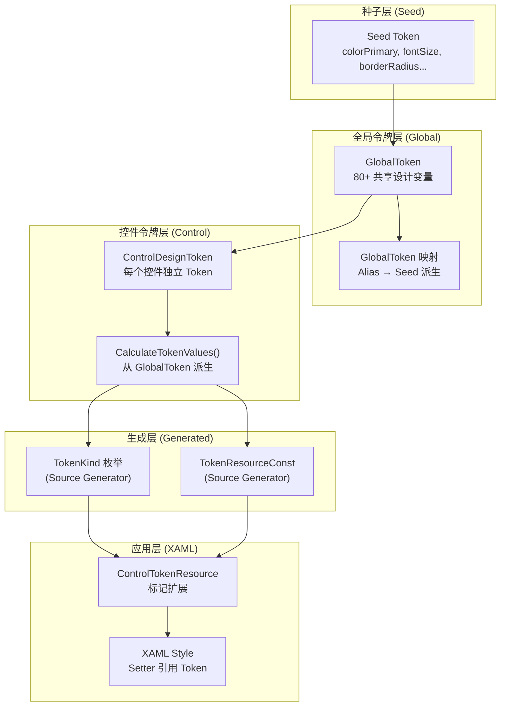
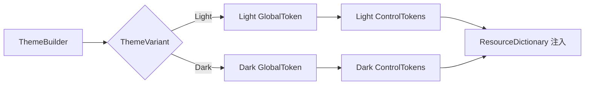

# 03 - 主题系统（深度分析）

## 概述

AtomUI 的主题系统是其核心创新，采用 **Design Token** 驱动架构，灵感来自 Ant Design 5.0 的动态主题方案。系统通过编译时 Source Generator + 运行时 Token 计算实现高度可定制、类型安全的主题体系。

> **权威参考**: `.github/copilot-instructions.md` 中的 Design Token System 章节是 Token 系统的权威规则定义。

### Token 三层推导链（Seed → Map → Alias）

Ant Design 5.0 将 Design Token 分解为三层，具有严格的推导链：

```
Seed Token ──(算法)──► Map Token ──(别名计算)──► Alias Token
  (起源)                (梯度)                    (语义)
```

1. **Seed Token** — 所有设计意图的起源。修改 Seed Token（如 `ColorPrimary`）会触发算法自动推导完整的梯度 Token 集。
   - 定义在 `DesignToken.Seed.cs`，标记 `[DesignTokenKind(DesignTokenKind.Seed)]`
   - 示例：`ColorPrimary`, `ColorSuccess`, `ColorWarning`, `ColorError`, `ColorInfo`, `FontSize`, `BorderRadius`, `SizeUnit`, `SizeStep`, `ControlHeight`, `LineWidth`, `EnableMotion`

2. **Map Token** — 由 Seed Token 通过主题算法推导的梯度变量，形成系统化的色板、尺寸阶梯和字体比例。
   - 定义在 `DesignToken.ColorPrimaryMap.cs`, `DesignToken.ColorMap.cs`, `DesignToken.FontMap.cs`, `DesignToken.SizeMap.cs`, `DesignToken.HeightMap.cs`, `DesignToken.StyleMap.cs` 等
   - 标记 `[DesignTokenKind(DesignTokenKind.Map)]`
   - 示例：`ColorPrimaryBg`(1号色), `ColorPrimaryBgHover`(2号色), `ColorPrimaryBorder`(3号色), `ColorPrimaryHover`(5号色), `ColorPrimaryActive`(7号色)

3. **Alias Token** — 语义化 Token，用于批量控制常见组件样式。本质上是 Map Token 的别名或特殊处理后的 Map Token。
   - 定义在 `DesignToken.Alias.cs`，标记 `[DesignTokenKind(DesignTokenKind.Alias)]`
   - 在 `DesignToken.CalculateAliasTokenValues()` 中计算
   - 示例：`ColorTextPlaceholder`, `ColorTextDisabled`, `ColorBgContainerDisabled`, `ColorSplit`, `PaddingContentHorizontal`, `ControlItemBgHover`

4. **Component Token**（`AbstractControlDesignToken` 子类）— 按组件 ID 作用域的 Token，从全局 `SharedToken` 推导所有值，并可为单个组件覆盖特定共享 Token。

### 主题算法

| 算法 | 类 | 用途 |
|------|---|------|
| `ThemeAlgorithm.Default` | `DefaultThemeVariantCalculator` | 亮色主题（默认） |
| `ThemeAlgorithm.Dark` | `DarkThemeVariantCalculator` | 暗色主题 |
| `ThemeAlgorithm.Compact` | `CompactThemeVariantCalculator` | 紧凑布局（更小尺寸/间距） |

算法可**组合** — 例如 Dark + Compact 产生暗色紧凑主题。`ThemeDefinition` 存储一组 `ThemeAlgorithm` 值。

## 架构总览



## GlobalToken 体系

### 种子 Token (Seed Token)

种子 Token 是主题的最底层变量，用户可通过自定义种子 Token 来生成完全不同的主题。

| 种子 Token | 类型 | 默认值(亮色) | 说明 |
|-----------|------|-------------|------|
| `colorPrimary` | Color | `#1677FF` | 主色 |
| `colorSuccess` | Color | `#52C41A` | 成功色 |
| `colorWarning` | Color | `#FAAD14` | 警告色 |
| `colorError` | Color | `#FF4D4F` | 错误色 |
| `colorInfo` | Color | `#1677FF` | 信息色 |
| `fontSize` | double | `14` | 基础字号 |
| `borderRadius` | double | `6` | 基础圆角 |
| `lineWidth` | double | `1` | 线宽 |
| `lineType` | string | `"solid"` | 线型 |
| `colorBgBase` | Color | `#FFFFFF` | 背景基色 |
| `colorTextBase` | Color | `#000000` | 文本基色 |
| `fontFamily` | string | (系统字体) | 字体族 |
| `sizeUnit` | double | `4` | 尺寸单位 |
| `sizeStep` | double | `4` | 尺寸步长 |
| `sizePopupArrow` | double | `16` | 弹出箭头尺寸 |
| `controlHeight` | double | `32` | 控件高度 |
| `zIndexBase` | int | `0` | 基础 z-index |
| `zIndexPopupBase` | int | `1050` | 弹出层 z-index |
| `motion` | bool | `true` | 是否启用动画 |
| `boxShadow` | string | (阴影值) | 基础阴影 |

### 别名 Token (Alias Token)

别名 Token 由种子 Token 派生，提供语义化的设计变量。

**颜色别名 Token（部分）：**

| 别名 Token | 派生规则 | 说明 |
|-----------|----------|------|
| `colorPrimaryBg` | colorPrimary 浅色变体 | 主色背景 |
| `colorPrimaryBgHover` | colorPrimary 浅色变体(hover) | 主色背景悬停 |
| `colorPrimaryBorder` | colorPrimary 浅色边框 | 主色边框 |
| `colorPrimaryHover` | colorPrimary 深色变体 | 主色悬停 |
| `colorPrimaryActive` | colorPrimary 更深变体 | 主色激活 |
| `colorText` | colorTextBase + 85% 透明度 | 主文本色 |
| `colorTextSecondary` | colorTextBase + 65% 透明度 | 次文本色 |
| `colorTextTertiary` | colorTextBase + 45% 透明度 | 三级文本色 |
| `colorTextQuaternary` | colorTextBase + 25% 透明度 | 四级文本色 |
| `colorBgContainer` | colorBgBase | 容器背景 |
| `colorBgElevated` | colorBgBase + 微调 | 浮层背景 |
| `colorBgLayout` | colorBgBase + 灰调 | 布局背景 |
| `colorBorder` | colorTextBase + 15% 透明度 | 边框色 |
| `colorBorderSecondary` | colorTextBase + 6% 透明度 | 次边框色 |
| `colorFill` | colorTextBase + 15% 透明度 | 填充色 |
| `colorFillSecondary` | colorTextBase + 8% 透明度 | 次填充色 |
| `colorFillTertiary` | colorTextBase + 4% 透明度 | 三级填充色 |
| `colorFillQuaternary` | colorTextBase + 2% 透明度 | 四级填充色 |

**尺寸别名 Token：**

| 别名 Token | 派生规则 | 说明 |
|-----------|----------|------|
| `fontSizeSM` | fontSize - 2 | 小字号 |
| `fontSizeLG` | fontSize + 2 | 大字号 |
| `fontSizeXL` | fontSize + 4 | 超大字号 |
| `fontSizeHeading1` | fontSize * 2.71 | 标题1字号 |
| `fontSizeHeading2` | fontSize * 2.14 | 标题2字号 |
| `fontSizeHeading3` | fontSize * 1.71 | 标题3字号 |
| `fontSizeHeading4` | fontSize * 1.42 | 标题4字号 |
| `fontSizeHeading5` | fontSize * 1.14 | 标题5字号 |
| `controlHeightSM` | controlHeight - 8 | 小控件高度 |
| `controlHeightLG` | controlHeight + 8 | 大控件高度 |
| `borderRadiusSM` | borderRadius - 2 | 小圆角 |
| `borderRadiusLG` | borderRadius + 4 | 大圆角 |

## ControlDesignToken 体系

### Token 类结构

每个控件的 Token 类遵循以下模式：

```csharp
public class ButtonToken : AbstractControlDesignToken
{
    public ButtonToken(GlobalToken globalToken) : base(globalToken) { }
    
    // 原始 Token（带 [TokenResourceKey] 标记）
    [TokenResourceKey] public double ContentFontSize { get; set; }
    [TokenResourceKey] public Thickness ContentPadding { get; set; }
    [TokenResourceKey] public double ContentHeight { get; set; }
    // ... 更多属性
    
    // SizeType 变体
    public ButtonToken SmallToken { get; set; }
    public ButtonToken LargeToken { get; set; }
    
    // StyleVariant 变体（如果有）
    // ...
    
    protected override void CalculateTokenValues()
    {
        // 从 GlobalToken 派生
        ContentFontSize = _globalToken.FontSize;
        ContentPadding = new Thickness(_globalToken.PaddingSM, 0);
        ContentHeight = _globalToken.ControlHeight;
        
        // 计算 SizeType 变体
        SmallToken = CreateSizeVariantToken(SizeType.Small);
        LargeToken = CreateSizeVariantToken(SizeType.Large);
    }
}
```

### 完整 Token 类清单

| Token 类 | 控件 | 关键 Token 属性数 | SizeType 变体 | StyleVariant 变体 |
|----------|------|-------------------|---------------|-------------------|
| `AlertToken` | Alert | ~15 | ✅ | — |
| `AutoCompleteToken` | AutoComplete | ~20 | ✅ | ✅ (Filled/Outlined/Borderless) |
| `AvatarToken` | Avatar | ~10 | ✅ | — |
| `BadgeToken` | Badge | ~15 | ✅ | — |
| `BreadcrumbToken` | Breadcrumb | ~10 | ✅ | — |
| `ButtonToken` | Button | ~30 | ✅ | ✅ (Default/Primary/Dashed/Link/Text) |
| `CalendarToken` | Calendar | ~20 | — | — |
| `CardToken` | Card | ~15 | ✅ | — |
| `CascaderToken` | Cascader | ~25 | ✅ | ✅ |
| `CheckBoxToken` | CheckBox | ~15 | ✅ | — |
| `ChromeToken` | WindowTitleBar | ~10 | — | — |
| `CollapseToken` | Collapse | ~15 | ✅ | — |
| `DatePickerToken` | DatePicker | ~20 | ✅ | — |
| `DescriptionsToken` | Descriptions | ~10 | ✅ | — |
| `DialogToken` | Dialog | ~20 | — | — |
| `DrawerToken` | Drawer | ~15 | — | — |
| `EmptyToken` | Empty | ~5 | ✅ | — |
| `ExpanderToken` | Expander | ~15 | ✅ | — |
| `FloatButtonToken` | FloatButton | ~15 | — | — |
| `FlyoutToken` | Flyout | ~15 | — | — |
| `FormToken` | Form | ~20 | ✅ | — |
| `GroupBoxToken` | GroupBox | ~10 | — | — |
| `ImagePreviewerToken` | ImagePreviewer | ~15 | — | — |
| `InputToken` / `LineEditToken` | LineEdit | ~30 | ✅ | ✅ (Filled/Outlined/Borderless) |
| `ListBoxToken` | ListBox | ~10 | ✅ | — |
| `ListViewToken` | ListView | ~10 | ✅ | — |
| `MarqueeLabelToken` | MarqueeLabel | ~5 | — | — |
| `MentionsToken` | Mentions | ~20 | ✅ | ✅ |
| `MenuToken` | Menu | ~20 | ✅ | — |
| `MessageToken` | Message | ~15 | — | — |
| `MessageBoxToken` | MessageBox | ~15 | — | — |
| `NavMenuToken` | NavMenu | ~25 | ✅ | — |
| `NotificationToken` | Notification | ~15 | — | — |
| `OptionButtonGroupToken` | OptionButtonGroup | ~10 | ✅ | — |
| `PaginationToken` | Pagination | ~15 | ✅ | — |
| `PopupHostToken` | Popup | ~15 | — | — |
| `PopupConfirmToken` | PopupConfirm | ~10 | — | — |
| `ProgressBarToken` | ProgressBar | ~15 | ✅ | — |
| `QRCodeToken` | QRCode | ~10 | — | — |
| `RadioButtonToken` | RadioButton | ~15 | ✅ | — |
| `RateToken` | Rate | ~10 | ✅ | — |
| `ResultToken` | Result | ~10 | — | — |
| `ScrollViewerToken` | ScrollViewer | ~10 | — | — |
| `SegmentedToken` | Segmented | ~15 | ✅ | — |
| `SelectToken` | Select | ~25 | ✅ | ✅ |
| `SeparatorToken` | Separator | ~5 | ✅ | — |
| `SkeletonToken` | Skeleton | ~15 | — | — |
| `SliderToken` | Slider | ~15 | — | — |
| `SpaceToken` | Space | ~5 | ✅ | — |
| `SpinToken` | Spin | ~10 | ✅ | — |
| `SplitterToken` | Splitter | ~10 | — | — |
| `StatisticToken` | Statistic | ~10 | — | — |
| `StepsToken` | Steps | ~15 | ✅ | — |
| `SwitchToken` | ToggleSwitch | ~15 | ✅ | — |
| `TabControlToken` | TabControl | ~20 | ✅ | — |
| `TagToken` | Tag | ~15 | ✅ | — |
| `TimePickerToken` | TimePicker | ~15 | ✅ | — |
| `TimelineToken` | Timeline | ~10 | — | — |
| `TooltipToken` | Tooltip | ~10 | — | — |
| `TourToken` | Tour | ~15 | — | — |
| `TransferToken` | Transfer | ~20 | — | — |
| `TreeSelectToken` | TreeSelect | ~15 | ✅ | — |
| `TreeViewToken` | TreeView | ~20 | ✅ | — |
| `UploadToken` | Upload | ~20 | — | — |
| `WindowToken` | Window | ~15 | — | — |
| `ColorPickerToken` | ColorPicker | ~20 | — | — |

## TokenResourceKey 标记机制

### 属性标记

Token 属性使用 `[TokenResourceKey]` Attribute 标记，Source Generator 据此生成代码：

```csharp
// 标记前（Token 类中）
[TokenResourceKey]
public double ContentFontSize { get; set; }

// Source Generator 生成后
public enum ButtonTokenKind
{
    ContentFontSize,
    // ...
}

public static class ButtonTokenResourceConst
{
    public static string ContentFontSize => "ButtonTokenContentFontSize";
    // ...
}
```

### XAML 引用方式

```xml
<!-- 通过 ControlTokenResource 标记扩展引用 -->
<Setter Property="FontSize" Value="{atom:ControlTokenResource Key=ContentFontSize}" />

<!-- 等价于 -->
<Setter Property="FontSize" Value="{DynamicResource ButtonTokenContentFontSize}" />
```

### ControlTokenResource 标记扩展实现

```csharp
public class ControlTokenResourceExtension : IMarkupExtension<object>
{
    public string Key { get; set; }
    
    public object ProvideValue(IServiceProvider serviceProvider)
    {
        // 解析当前控件类型
        // 查找对应的 TokenResourceConst 映射
        // 返回 DynamicResource 绑定
    }
}
```

## 主题变体系统

### 亮色/暗色切换



### ThemeVariantCalculator

每个控件有一个 `ThemeVariantCalculator`，负责：
1. 监听主题变体切换事件
2. 重新计算当前变体下的 Token 值
3. 更新 ResourceDictionary 中的资源

```csharp
public abstract class AbstractThemeVariantCalculator : IThemeVariantCalculator
{
    public abstract void Calculate(TokenResourceType resourceType, 
                                   AbstractControlDesignToken token, 
                                   IResourceDictionary resourceDictionary);
}
```

### 主题变体切换流程

1. 用户调用 `ThemeBuilder.SwitchThemeVariant(ThemeVariant.Dark)`
2. `ThemeBuilder` 重新计算 `GlobalToken`（暗色种子值）
3. 遍历所有已注册的 `ControlDesignToken`，调用 `CalculateTokenValues()`
4. 每个 Token 的 `ThemeVariantCalculator` 将新值写入 `ResourceDictionary`
5. Avalonia 的 `DynamicResource` 机制自动更新 UI

## 颜色系统 (ColorPalette)

### Ant Design 色板算法

AtomUI 实现了 Ant Design 的颜色算法，从基色生成 10 级色板：

```
输入: colorPrimary = #1677FF
输出:
  colorPrimary-1:  #E6F4FF  (最浅)
  colorPrimary-2:  #BAE0FF
  colorPrimary-3:  #91CAFF
  colorPrimary-4:  #69B1FF
  colorPrimary-5:  #4096FF
  colorPrimary-6:  #1677FF  (基色)
  colorPrimary-7:  #0958D9
  colorPrimary-8:  #003EB3
  colorPrimary-9:  #002C8C
  colorPrimary-10: #001D66  (最深)
```

### ColorPalette 类

```csharp
public class ColorPalette
{
    // 从基色生成色板
    public static List<Color> Generate(Color baseColor);
    
    // 生成指定索引的颜色
    public static Color Generate(Color baseColor, int index);
    
    // 亮色模式算法
    public static Color GenerateForLight(Color baseColor, int index);
    
    // 暗色模式算法
    public static Color GenerateForDark(Color baseColor, int index);
}
```

## 添加新控件主题的完整流程

### 步骤 1: 创建 Token 类

```csharp
// 文件: src/AtomUI.Desktop.Controls/MyControl/MyControlToken.cs
public class MyControlToken : AbstractControlDesignToken
{
    public MyControlToken(GlobalToken globalToken) : base(globalToken) { }
    
    [TokenResourceKey] public double ContentFontSize { get; set; }
    [TokenResourceKey] public Thickness ContentPadding { get; set; }
    [TokenResourceKey] public Color BackgroundColor { get; set; }
    [TokenResourceKey] public Color BorderColor { get; set; }
    
    public MyControlToken SmallToken { get; set; }
    public MyControlToken LargeToken { get; set; }
    
    protected override void CalculateTokenValues()
    {
        ContentFontSize = _globalToken.FontSize;
        ContentPadding = new Thickness(_globalToken.PaddingSM);
        BackgroundColor = _globalToken.ColorBgContainer;
        BorderColor = _globalToken.ColorBorder;
        
        // SizeType 变体
        SmallToken = CreateSizeVariantToken(SizeType.Small);
        LargeToken = CreateSizeVariantToken(SizeType.Large);
    }
}
```

### 步骤 2: 创建 ThemeConstants

```csharp
// 文件: src/AtomUI.Desktop.Controls/MyControl/MyControlThemeConstants.cs
public static class MyControlThemeConstants
{
    public const string MyControlThemeKey = "MyControlTheme";
    // 定义共享常量
}
```

### 步骤 3: 创建 Theme AXAML

```xml
<!-- 文件: src/AtomUI.Desktop.Controls/MyControl/MyControlTheme.axaml -->
<Styles xmlns="https://github.com/avaloniaui"
        xmlns:atom="https://atomui.net"
        xmlns:x="http://schemas.microsoft.com/winfx/2006/xaml">
    
    <Design.PreviewWith>
        <atom:MyControl />
    </Design.PreviewWith>
    
    <Style Selector="atom|MyControl">
        <Setter Property="FontSize" Value="{atom:ControlTokenResource Key=ContentFontSize}" />
        <Setter Property="Background" Value="{atom:ControlTokenResource Key=BackgroundColor}" />
        <Setter Property="BorderBrush" Value="{atom:ControlTokenResource Key=BorderColor}" />
    </Style>
    
    <!-- SizeType 变体样式 -->
    <Style Selector="atom|MyControl:small">
        <Setter Property="FontSize" Value="{atom:ControlTokenResource Key=SmallToken.ContentFontSize}" />
    </Style>
</Styles>
```

### 步骤 4: 注册到 Provider

```xml
<!-- 文件: src/AtomUI.Desktop.Controls/Theming/Providers/DesktopControlThemesProvider.axaml -->
<Styles ...>
    <!-- 添加新控件主题 -->
    <StyleInclude Source="avares://AtomUI.Desktop.Controls/MyControl/MyControlTheme.axaml" />
</Styles>
```

### 步骤 5: 编译触发 Generator

```bash
dotnet build src/AtomUI.Desktop.Controls
```

Source Generator 自动生成：
- `MyControlTokenKind.g.cs`
- `MyControlTokenResourceConst.g.cs`

### 步骤 6: 验证

在 Gallery 中添加展示页面，确认：
- ✅ 亮色/暗色主题切换正常
- ✅ SizeType 变体正确
- ✅ StyleVariant 变体正确（如有）
- ✅ Token 值在 XAML 中正确引用