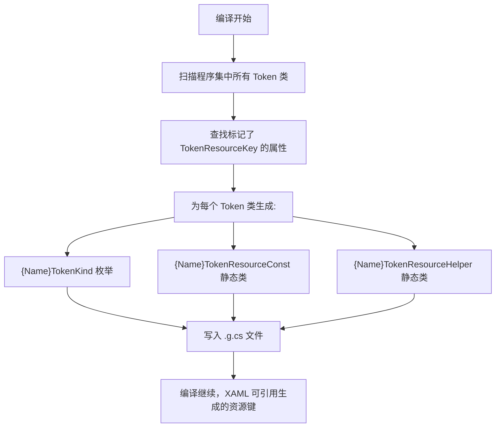
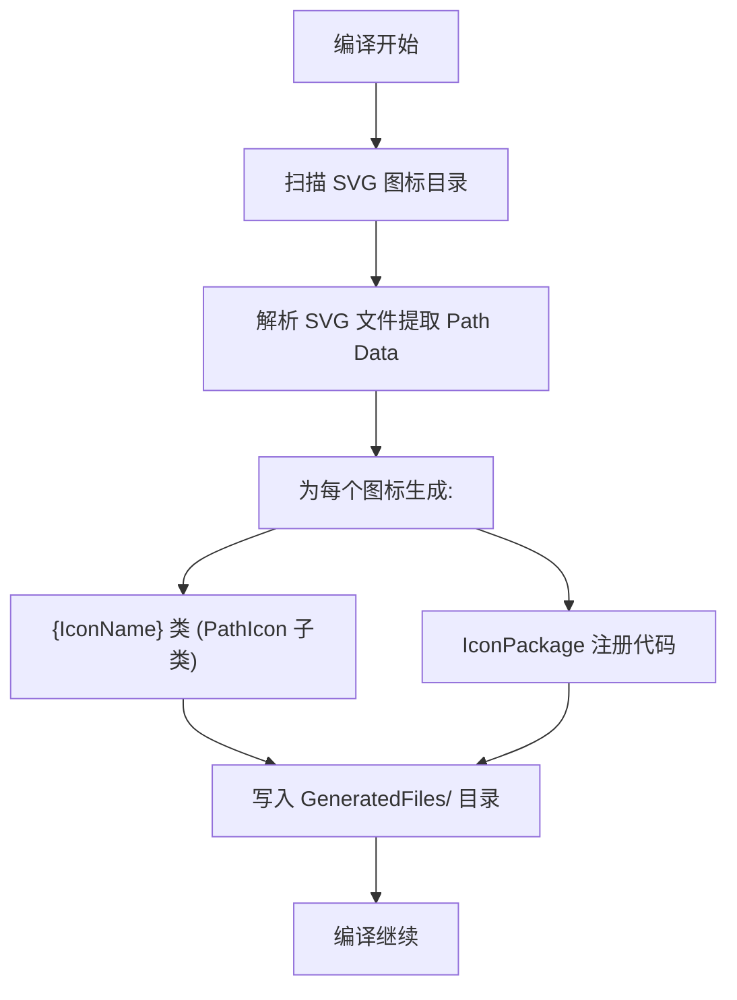

# 05 - 生成器系统

## 概述

AtomUI 使用两个 Source Generator 实现编译时代码生成，这是主题系统和图标系统的核心基础设施。

## 生成器清单

| 生成器 | 项目 | 输出目标 | 触发条件 |
|--------|------|----------|----------|
| `AtomUI.SourceGenerators` | AtomUI.SourceGenerators | AtomUI.Controls, AtomUI.Desktop.Controls | Token 类中 `[TokenResourceKey]` 属性变更 |
| `AtomUI.Icons.AntDesign.Generator` | AtomUI.Icons.AntDesign.Generator | AtomUI.Icons.AntDesign | SVG 图标文件变更 |

---

## Token Source Generator

### 工作原理



### 生成代码示例

**输入** (ButtonToken.cs):
```csharp
public class ButtonToken : AbstractControlDesignToken
{
    [TokenResourceKey] public double ContentFontSize { get; set; }
    [TokenResourceKey] public Thickness ContentPadding { get; set; }
    [TokenResourceKey] public double ContentHeight { get; set; }
    [TokenResourceKey] public CornerRadius CornerRadius { get; set; }
    // ...
}
```

**输出1** (ButtonTokenKind.g.cs):
```csharp
public enum ButtonTokenKind
{
    ContentFontSize,
    ContentPadding,
    ContentHeight,
    CornerRadius,
    // ... 所有标记了 [TokenResourceKey] 的属性
}
```

**输出2** (ButtonTokenResourceConst.g.cs):
```csharp
public static class ButtonTokenResourceConst
{
    public const string ContentFontSize = "ButtonTokenContentFontSize";
    public const string ContentPadding = "ButtonTokenContentPadding";
    public const string ContentHeight = "ButtonTokenContentHeight";
    public const string CornerRadius = "ButtonTokenCornerRadius";
    // ...
}
```

**输出3** (ButtonTokenResourceHelper.g.cs):
```csharp
public static class ButtonTokenResourceHelper
{
    public static void RegisterResources(IResourceDictionary dictionary, ButtonToken token)
    {
        dictionary["ButtonTokenContentFontSize"] = token.ContentFontSize;
        dictionary["ButtonTokenContentPadding"] = token.ContentPadding;
        dictionary["ButtonTokenContentHeight"] = token.ContentHeight;
        dictionary["ButtonTokenCornerRadius"] = token.CornerRadius;
        // ...
    }
}
```

### TokenResourceKey Attribute

```csharp
[AttributeUsage(AttributeTargets.Property)]
public class TokenResourceKeyAttribute : Attribute
{
    // 标记 Token 属性，Source Generator 据此生成代码
}
```

### 生成文件位置

```
obj/Debug/net8.0/generated/AtomUI.SourceGenerators/
├── AtomUI.Controls/
│   ├── ButtonTokenKind.g.cs
│   ├── ButtonTokenResourceConst.g.cs
│   └── ...
└── AtomUI.Desktop.Controls/
    ├── AlertTokenKind.g.cs
    ├── AlertTokenResourceConst.g.cs
    └── ...
```

---

## Icon Source Generator

### 工作原理



### 图标生成流程

1. **SVG 文件扫描**: 扫描 `Assets/` 目录下的 SVG 文件
2. **Path Data 提取**: 从 SVG 中提取 `<path d="..."/>` 数据
3. **代码生成**: 为每个图标生成一个 C# 类

### 生成代码示例

**输入** (SVG 文件: `account-book-filled.svg`):
```xml
<svg viewBox="0 0 1024 1024">
  <path d="M880 184H716v-64c0-4.4-3.6-8-8-8h-56c-4.4 0-8 3.6-8 8v64H384v-64c0-4.4-3.6-8-8-8h-56c-4.4 0-8 3.6-8 8v64H144c-17.7 0-32 14.3-32 32v664c0 17.7 14.3 32 32 32h736c17.7 0 32-14.3 32-32V216c0-17.7-14.3-32-32-32zM648.3 654.2h-79.5v79.5c0 4.4-3.6 8-8 8h-41.6c-4.4 0-8-3.6-8-8v-79.5h-79.5c-4.4 0-8-3.6-8-8v-41.6c0-4.4 3.6-8 8-8h79.5v-79.5c0-4.4 3.6-8 8-8h41.6c4.4 0 8 3.6 8 8v79.5h79.5c4.4 0 8 3.6 8 8v41.6c0 4.4-3.6 8-8 8z"/>
</svg>
```

**输出** (AccountBookFilled.cs):
```csharp
public class AccountBookFilled : PathIcon
{
    public AccountBookFilled()
    {
        Data = StreamGeometry.Parse("M880 184H716v-64c0-4.4-3.6-8-8-8h-56...");
    }
}
```

### Ant Design 图标包结构

```
AtomUI.Icons.AntDesign/
├── AtomUI.Icons.AntDesign.csproj
├── Assets/                          # SVG 源文件
│   ├── Filled/
│   ├── Outlined/
│   └── Twotone/
├── GeneratedFiles/                  # 生成的 C# 代码
│   ├── Filled/
│   ├── Outlined/
│   └── Twotone/
├── AntDesignIconPackage.cs          # 图标包注册
└── AntDesignIconTheme.cs            # 图标主题
```

### 图标变体

Ant Design 图标提供三种变体：
- **Filled** (实心) — 默认变体
- **Outlined** (线框) — 线条风格
- **Twotone** (双色) — 双色风格

### 图标使用方式

```xml
<!-- XAML 中使用 -->
<atom:IconPresenter Icon="{atom:AntDesignIcon AccountBookFilled}" />

<!-- 代码中使用 -->
var icon = new IconPresenter();
icon.Icon = AntDesignIconPackage.Instance.GetIcon("AccountBookFilled");
```

### AbstractIconPackageGenerator

```csharp
public abstract class AbstractIconPackageGenerator
{
    // 子类实现具体的图标包生成逻辑
    protected abstract string IconNamespace { get; }
    protected abstract string AssetsPath { get; }
    
    // 生成图标类代码
    protected string GenerateIconClass(string iconName, string pathData);
    
    // 生成图标包注册代码
    protected string GenerateIconPackageRegistration();
}
```

---

## Generator 调试与排障

### 常见问题

| 问题 | 原因 | 解决方案 |
|------|------|----------|
| Token 属性在 XAML 中不生效 | Source Generator 未重新运行 | 清理并重新编译: `dotnet clean && dotnet build` |
| 图标类找不到 | SVG 文件未包含在项目中 | 检查 `.csproj` 中的 `<EmbeddedResource>` 配置 |
| 生成的代码有编译错误 | Token 类定义不完整 | 确保 Token 属性有 `[TokenResourceKey]` 标记且类型正确 |
| IDE 不识别生成的代码 | IDE 缓存问题 | 重启 IDE 或执行 `dotnet build` 刷新 |

### 查看生成代码

```bash
# 查看 Token 生成代码
find src/AtomUI.Desktop.Controls/obj -name "*.g.cs" | head -20

# 查看图标生成代码
ls src/AtomUI.Icons.AntDesign/GeneratedFiles/
```

### 强制重新生成

```bash
# 清理所有生成文件
dotnet clean

# 删除 obj 目录（彻底清理）
find src -name "obj" -type d -exec rm -rf {} + 2>/dev/null

# 重新编译
dotnet build