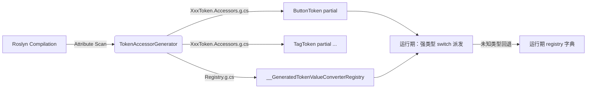

# 方案 4.1：Token 值转换器反射 → Source Generator

> 对应性能报告条目：`docs/Issues/performance_memory_leak.md` §4.1
> 目标：用 `AtomUI.Generator` 在编译期生成强类型 Token 访问器与转换器注册，彻底消除 `AbstractDesignToken` 体系中的运行期反射。
> 适用框架：`netstandard2.0`（Generator）/ `net8.0;net10.0`（运行时）
> 最后更新：2026-04-17

---

## 目录

1. [TL;DR](#tldr)
2. [现状分析](#1-现状分析)
3. [设计目标](#2-设计目标)
4. [总体方案](#3-总体方案)
5. [实施步骤（按 PR 拆分）](#4-实施步骤按-pr-拆分)
6. [受影响文件清单](#5-受影响文件清单)
7. [API / 兼容性评估](#6-api--兼容性评估)
8. [风险与回滚](#7-风险与回滚)
9. [测试方案](#8-测试方案)
10. [进一步确认项](#9-进一步确认项)

---

## TL;DR

`AtomUI.Core` 在 Token 系统中共有 **7 处**基于 `System.Reflection` 的热点，覆盖转换器注册、`LoadConfig`、`BuildResourceDictionary`、`GetTokenValue` / `SetTokenValue`、`Clone`、`BuildSharedResourceDeltaDictionary` 以及 `DesignToken.GetTokenProperties`。

方案在 `src/AtomUI.Generator` 中新增 **`TokenAccessorGenerator`**，为每个 `DesignToken` / `[ControlDesignToken]` 子类生成 `partial` 的强类型访问器（`switch`/`nameof` 派发）与转换器分发表，同时自动发现并注册所有 `[TokenValueConverter]`。运行期反射彻底移除，保持公开 API 零破坏，保留运行期自定义扩展入口，并为 NativeAOT 打通路径。

---

## 1. 现状分析

### 1.1 反射位置与开销

> 源文件：
> - [`src/AtomUI.Core/Theme/TokenSystem/AbstractDesignToken.cs`](../../src/AtomUI.Core/Theme/TokenSystem/AbstractDesignToken.cs)
> - [`src/AtomUI.Core/Theme/TokenSystem/AbstractControlDesignToken.cs`](../../src/AtomUI.Core/Theme/TokenSystem/AbstractControlDesignToken.cs)
> - [`src/AtomUI.Core/Theme/TokenSystem/TokenDefinitions/DesignToken.cs`](../../src/AtomUI.Core/Theme/TokenSystem/TokenDefinitions/DesignToken.cs)

| # | 位置 | 反射动作 | 调用频率 | 影响 |
|---|---|---|---|---|
| A | `AbstractDesignToken` 静态构造函数（L14–28） | `Assembly.GetExecutingAssembly().GetTypes()` + `IsDefined(TokenValueConverterAttribute)` + `Activator.CreateInstance` | 首次触发 Token 系统时一次 | 启动期 ~ms 级；仅扫描 Core 程序集，**跨程序集自定义 converter 目前根本无法被发现** |
| B | `AbstractDesignToken.LoadConfig`（L30–73） | `GetType().GetProperties(...)` + `PropertyInfo.SetValue` | 每次主题加载/切换，每个 Token 类一次 | 每次主题切换全量反射 |
| C | `AbstractDesignToken.BuildResourceDictionary`（L75–103） + `AbstractControlDesignToken.BuildResourceDictionary`（L39–71） | `GetProperties` + `PropertyInfo.GetValue` + enum 反射 | 每次主题构建、全部 Token 遍历 | 热路径，~n × m 次反射 |
| D | `GetTokenValue` / `SetTokenValue`（L105–138） | `GetProperty` + `GetValue` / `SetValue` | 每次访问未缓存的 token | 运行期高频（首次访问慢） |
| E | `Clone`（L140–153） | `GetProperties` + `Activator.CreateInstance` | 每个控件 Token 作用域克隆一次 | 中频 |
| F | `AbstractControlDesignToken.BuildSharedResourceDeltaDictionary`（L73–111） | `GetProperties` + `GetValue` + `Enum.TryParse` | 控件作用域与全局 Token 不同时触发 | 中频 |
| G | `DesignToken.GetTokenProperties`（L279–291） | `GetProperties` + `GetCustomAttribute` | 按 `DesignTokenKind` 筛选属性 | 较低，但仍可预生成 |

### 1.2 转换器注册现状

- `[TokenValueConverter]` 实例只在 [`BuiltInTokenValueConverters.cs`](../../src/AtomUI.Core/Theme/TokenSystem/BuiltInTokenValueConverters.cs) 中定义：`String`、`Int`、`Double`、`Float`、`Bool`、`Color`、`BoxShadows`、`TextDecorationInfo`、`LineStyle`、`Thickness`、`CornerRadius`。
- `LoadConfig` 用字典按 `PropertyType` 查 converter；未命中则落入 `property.SetValue(tokenName, rawValue)` —— **这里还藏着一个历史 bug**：实参传了 `tokenName`（字符串）而非 `this`，说明该回退分支从未被真正覆盖。

### 1.3 `[ControlDesignToken]` 分布

`src/AtomUI.Desktop.Controls/**/*Token.cs` 共约 **20+** 个控件 Token 类（Button / Tag / Avatar / Menu / DatePicker / Transfer 等），属性类型集中在：
`Color`、`double`、`int`、`Thickness`、`CornerRadius`、`BoxShadows`、`TextDecorationInfo`、`FontFamily`、`LineStyle`、`FontWeight` 及少量枚举。

### 1.4 Generator 基础设施

> 根目录：[`src/AtomUI.Generator/`](../../src/AtomUI.Generator/)

- `netstandard2.0`，`IsRoslynComponent=true`，作为 Analyzer-only 被消费。
- 采用 `IIncrementalGenerator`，通过 `SyntaxProvider.ForAttributeWithMetadataName` 捕获 `GlobalDesignTokenAttribute` 与 `ControlDesignTokenAttribute`。
- 现有入口：`TokenResourceKeyGenerator.cs`；辅助 walker：`TokenPropertyWalker`、`ControlTokenPropertyWalker`；代码发射器：`ResourceKeyClassWriter`。
- 产物写入各消费项目的 `GeneratedFiles/`，通过 `context.AddSource("xxx.g.cs", ...)` 嵌入编译。

---

## 2. 设计目标

1. **消除反射**：A/B/C/D/E/F/G 七处反射全部替换为编译期生成的强类型代码。
2. **保持公开 API**：`LoadConfig`、`BuildResourceDictionary`、`GetTokenValue`、`SetTokenValue`、`Clone` 签名不变；`CalculateTokenValues` 用法不变；`[ControlDesignToken]`、`[TokenValueConverter]`、`[NotTokenDefinition]`、`[DesignTokenKind]`、`SharedToken` 全部保留。
3. **保留可扩展性**：支持第三方程序集在运行期注册自定义 `ITokenValueConverter`；未知属性类型回退到运行期字典。
4. **严守分层**：生成产物直接随 `AtomUI.Core` / `AtomUI.Desktop.Controls` 的编译嵌入；Generator 仍是 `netstandard2.0` + Analyzer-only，不引入对上层项目的依赖。
5. **AOT 友好**：移除 `Activator.CreateInstance(Type)` 与 `GetProperties`，为未来 `PublishAot` 铺路。

---

## 3. 总体方案

### 3.1 新增 Generator：`TokenAccessorGenerator`

位置：`src/AtomUI.Generator/DesignToken/TokenAccessorGenerator.cs`，与现有 `TokenResourceKeyGenerator` 共存。

**输入采集：**

- `ForAttributeWithMetadataName(GlobalDesignTokenAttribute)` → 捕获 `DesignToken`（以及未来可能新增的全局 token 类）。
- `ForAttributeWithMetadataName(ControlDesignTokenAttribute)` → 捕获所有控件 Token 类。
- `ForAttributeWithMetadataName("AtomUI.Theme.TokenSystem.TokenValueConverterAttribute")` → 捕获内建 + 任意程序集中的自定义 converter（新增到 `TargetMarkConstants`）。

**每个 Token 类收集：**
类名、命名空间、所有可访问且可读可写的实例属性（名称、完全限定类型、是否 `Color`/`Color?`、是否带 `[NotTokenDefinition]`、是否带 `[DesignTokenKind(...)]`）。

### 3.2 生成物 1：Token 类的 `partial` 强类型访问器

要求：所有目标类改为 `partial`。对每个类生成 `XxxToken.Accessors.g.cs`：

```csharp
// <auto-generated />
#nullable enable
namespace AtomUI.Desktop.Controls;

partial class ButtonToken
{
    public override object? GetTokenValue(string name) => name switch
    {
        nameof(FontWeight)    => FontWeight,
        nameof(DefaultShadow) => DefaultShadow,
        nameof(PrimaryColor)  => PrimaryColor,
        // ... 每个属性一条
        _ => base.GetTokenValue(name),
    };

    public override void SetTokenValue(string name, object value)
    {
        switch (name)
        {
            case nameof(FontWeight):    FontWeight    = (double)value; return;
            case nameof(DefaultShadow): DefaultShadow = (global::Avalonia.Media.BoxShadows)value; return;
            case nameof(PrimaryColor):  PrimaryColor  = (global::Avalonia.Media.Color)value; return;
            // ...
            default: base.SetTokenValue(name, value); return;
        }
    }

    protected override void LoadConfigCore(
        global::System.Collections.Generic.IDictionary<string, string> cfg,
        global::AtomUI.Theme.TokenSystem.ITokenValueConverterRegistry converters)
    {
        foreach (var kv in cfg)
        {
            switch (kv.Key)
            {
                case nameof(PrimaryColor):
                    PrimaryColor = (global::Avalonia.Media.Color)converters.Convert(
                        typeof(global::Avalonia.Media.Color), kv.Value);
                    break;
                // ...
                default:
                    base.LoadConfigCore(cfg, converters);
                    break;
            }
        }
    }

    protected override void BuildResourceDictionaryCore(global::Avalonia.Controls.IResourceDictionary dict)
    {
        dict[global::AtomUI.Desktop.Controls.DesignTokens.ButtonKind.FontWeight]    = FontWeight;
        dict[global::AtomUI.Desktop.Controls.DesignTokens.ButtonKind.DefaultShadow] = DefaultShadow;
        // Color 属性自动包装为 ImmutableSolidColorBrush（参见 §4.3 低危项，生成器是落地点）
        dict[global::AtomUI.Desktop.Controls.DesignTokens.ButtonKind.PrimaryColor]
            = new global::Avalonia.Media.Immutable.ImmutableSolidColorBrush(PrimaryColor);
        // ...
    }

    protected override global::AtomUI.Theme.TokenSystem.AbstractDesignToken CloneCore()
    {
        var cloned = new ButtonToken();
        cloned.FontWeight    = FontWeight;
        cloned.DefaultShadow = DefaultShadow;
        cloned.PrimaryColor  = PrimaryColor;
        // ...
        return cloned;
    }
}
```

### 3.3 生成物 2：全局转换器注册器

生成到 `AtomUI.Core`（或各消费程序集自身）中的 `__GeneratedTokenValueConverterRegistry.g.cs`：

```csharp
// <auto-generated />
namespace AtomUI.Theme.TokenSystem;

internal static class __GeneratedTokenValueConverterRegistry
{
    public static void Register(ITokenValueConverterRegistry registry)
    {
        registry.Register(typeof(string),            new StringTokenValueConverter());
        registry.Register(typeof(int),               new IntegerTokenValueConverter());
        registry.Register(typeof(double),            new DoubleTokenValueConverter());
        registry.Register(typeof(global::Avalonia.Media.Color),        new ColorTokenValueConverter());
        registry.Register(typeof(global::Avalonia.Thickness),          new ThicknessTokenValueConverter());
        registry.Register(typeof(global::Avalonia.CornerRadius),       new CornerRadiusTokenValueConverter());
        // ... 由 [TokenValueConverter] 自动发现
    }
}
```

### 3.4 `AbstractDesignToken` 改造要点

- 类声明追加 `partial`。
- 新增 `protected virtual` 空实现：`LoadConfigCore`、`BuildResourceDictionaryCore`、`CloneCore`（供生成 `override` 覆盖）。
- `GetTokenValue` / `SetTokenValue` 改为 `public virtual`，默认实现退化为"未知 token 返回 null / 抛异常"；子类通过生成代码以 `override` 覆盖。
- 静态构造函数简化：仅调用 `__GeneratedTokenValueConverterRegistry.Register(Registry)`；不再做 `Assembly.GetTypes()` 扫描。
- 引入 `ITokenValueConverterRegistry`（含 `Register(Type, ITokenValueConverter)` 与 `object Convert(Type, string)`），让第三方在运行期通过 `ThemeManager` API 额外注册 converter。
- `DesignToken.GetTokenProperties(DesignTokenKind)` 改为生成的静态查表（按 `DesignTokenKindAttribute` 预先分组）。

### 3.5 控制流



---

## 4. 实施步骤（按 PR 拆分）

### PR-1：基础设施 & API 扩展（不改行为）

- 新增 `ITokenValueConverterRegistry` 与默认实现 `TokenValueConverterRegistry`（保留现有反射扫描作为 fallback 源）。
- 为 `AbstractDesignToken` / `AbstractControlDesignToken` / `DesignToken` 增加 `partial`，新增 `LoadConfigCore`、`BuildResourceDictionaryCore`、`CloneCore` 虚方法，默认实现调用现有反射路径。
- 将 `[TokenValueConverter]` 加入 `TargetMarkConstants`。

### PR-2：新增 `TokenAccessorGenerator`（默认关闭）

- `src/AtomUI.Generator/DesignToken/TokenAccessorGenerator.cs`
- 复用 `ControlTokenPropertyWalker` 的属性采集逻辑，抽取公共 `TokenPropertyModel`（Name、Type、IsColor、DesignTokenKind）。
- 抽象代码发射器 `TokenAccessorClassWriter`（借鉴 `ResourceKeyClassWriter`，仍用 `SyntaxFactory` 或直接 `StringBuilder`）。
- 通过 MSBuild 属性 `AtomUITokenAccessorGen` 控制是否写出；核心类的 `override` 体包裹在 `#if ATOMUI_GENERATED_ACCESSORS` 中，默认关闭。

### PR-3：切换默认路径 + 一致性校验

- 打开 `ATOMUI_GENERATED_ACCESSORS`。
- DEBUG 下保留旧反射路径作为"影子执行"，断言两条路径结果一致（供 CI 回归）。
- `tests/AtomUI.Base.Tests/` 增加端到端断言：构建所有 `ThemeAlgorithm` 组合下 `ResourceDictionary` 的内容，对比 JSON 快照。

### PR-4：清理反射代码

- 删除 `AbstractDesignToken` 中的 `GetProperties` / `SetValue` / `GetValue` 回退路径（保留未知属性的运行期字典回退入口）。
- 顺带修复 L59 `property.SetValue(tokenName, ...)` 历史 bug（此时该分支已不再存在）。

---

## 5. 受影响文件清单

### 新增

- `/Users/chinboy/Projects/dotnet/AtomUI/src/AtomUI.Generator/DesignToken/TokenAccessorGenerator.cs`
- `/Users/chinboy/Projects/dotnet/AtomUI/src/AtomUI.Generator/DesignToken/TokenAccessorClassWriter.cs`
- `/Users/chinboy/Projects/dotnet/AtomUI/src/AtomUI.Generator/DesignToken/TokenValueConverterWalker.cs`
- `/Users/chinboy/Projects/dotnet/AtomUI/src/AtomUI.Core/Theme/TokenSystem/ITokenValueConverterRegistry.cs`
- `/Users/chinboy/Projects/dotnet/AtomUI/src/AtomUI.Core/Theme/TokenSystem/TokenValueConverterRegistry.cs`
- `/Users/chinboy/Projects/dotnet/AtomUI/tests/AtomUI.Generator.Tests/TokenAccessorGoldenTests.cs`
- `/Users/chinboy/Projects/dotnet/AtomUI/tests/AtomUI.Base.Tests/Theme/TokenAccessorConsistencyTests.cs`
- `/Users/chinboy/Projects/dotnet/AtomUI/docs/Generator/TokenAccessorGenerator.md`

### 修改

- `/Users/chinboy/Projects/dotnet/AtomUI/src/AtomUI.Generator/TargetMarkConstants.cs`（新增 `TokenValueConverterAttribute`）
- `/Users/chinboy/Projects/dotnet/AtomUI/src/AtomUI.Core/Theme/TokenSystem/AbstractDesignToken.cs`（`partial` + 新 hook + 删除反射）
- `/Users/chinboy/Projects/dotnet/AtomUI/src/AtomUI.Core/Theme/TokenSystem/AbstractControlDesignToken.cs`（同上）
- `/Users/chinboy/Projects/dotnet/AtomUI/src/AtomUI.Core/Theme/TokenSystem/TokenDefinitions/DesignToken.cs`（`partial`；`GetTokenProperties` 改为生成版本）
- `/Users/chinboy/Projects/dotnet/AtomUI/src/AtomUI.Desktop.Controls/**/??Token.cs`（共 20+ 个文件追加 `partial` 关键字）

### 无需修改但受惠

- `src/AtomUI.Core/Theme/Theme.cs`
- `src/AtomUI.Core/Theme/ThemeConfigProvider.cs`

调用方语义完全不变。

---

## 6. API / 兼容性评估

- `[ControlDesignToken]` / `[TokenValueConverter]` / `CalculateTokenValues(bool)` / `SharedToken` / `GetTokenKindType()`：**保持不变**。
- `LoadConfig` 签名保持；行为一致（首选强类型，未知类型走 registry）。
- `Clone` 返回类型保持为 `AbstractDesignToken`。
- `GetTokenValue` / `SetTokenValue` 语义保持（仍支持按名访问，性能提升）。
- 新增的 `partial` 关键字**不是破坏性变更**；但要求所有子类文件也标 `partial` —— 属机械性改动，可由脚本批处理或 Roslyn CodeFix 一键完成。

---

## 7. 风险与回滚

1. **生成代码编译失败**：通过 PR-2 中的 `ATOMUI_GENERATED_ACCESSORS` 编译开关可立即回滚到反射实现。
2. **`netstandard2.0` 限制**：`FrozenDictionary` 仅 .NET 8+；生成代码需在 `#if NET8_0_OR_GREATER` 分支使用，或一律退化为 `Dictionary` + 静态只读。
3. **第三方 Token**：若用户在自己程序集里继承 `AbstractControlDesignToken` 而未引用 `AtomUI.Generator`，仍走运行期反射回退 —— 不破坏功能，但得不到性能红利。文档中需明示，并在项目模板里默认引入 Generator。
4. **AOT 收益**：移除 `Activator.CreateInstance` 与 `GetProperties`，让 Token 系统具备适配 `PublishAot` 的基础。

---

## 8. 测试方案

- `tests/AtomUI.Generator.Tests/TokenAccessorGoldenTests.cs`：为 `ButtonToken`、`TagToken`、`DesignToken` 生成 `.verified.cs` 金文件，使用 Verify/Shouldly 做稳定文本比对。
- `tests/AtomUI.Base.Tests/Theme/TokenAccessorConsistencyTests.cs`：对每个 `ControlDesignToken` 子类，在反射路径（旧）与生成路径（新）各构建一次 `IResourceDictionary`，断言键值全等；覆盖所有主题组合（Default / Dark / Compact / Dark+Compact）× 所有 `ControlToken`。
- 基准测试（可选）：若已有 `tests/AtomUI.Base.Tests/Benchmarks/`，对比 `LoadConfig` / `BuildResourceDictionary` 的吞吐，量化收益。

---

## 9. 进一步确认项

1. 是否希望保留 `GetTokenValue` / `SetTokenValue` 的字符串键？若允许改为 `enum` 键（`SharedTokenKind` / `XxxKind`），性能可再提升一层（`FrozenDictionary<enum, …>` 或纯 `switch`）。**建议保留字符串重载 + 新增 enum 重载**。
2. 是否接受引入 `ITokenValueConverterRegistry` 这一新的公开类型？或倾向保持 `_valueConverters` 为 `internal static` 并只增加 `internal` 注册入口（侵入面更小）。
3. `BuildSharedResourceDeltaDictionary`（F）当前也是反射全量扫描；是否一并纳入本次 PR 链？**建议一并处理**，否则分层不彻底。

