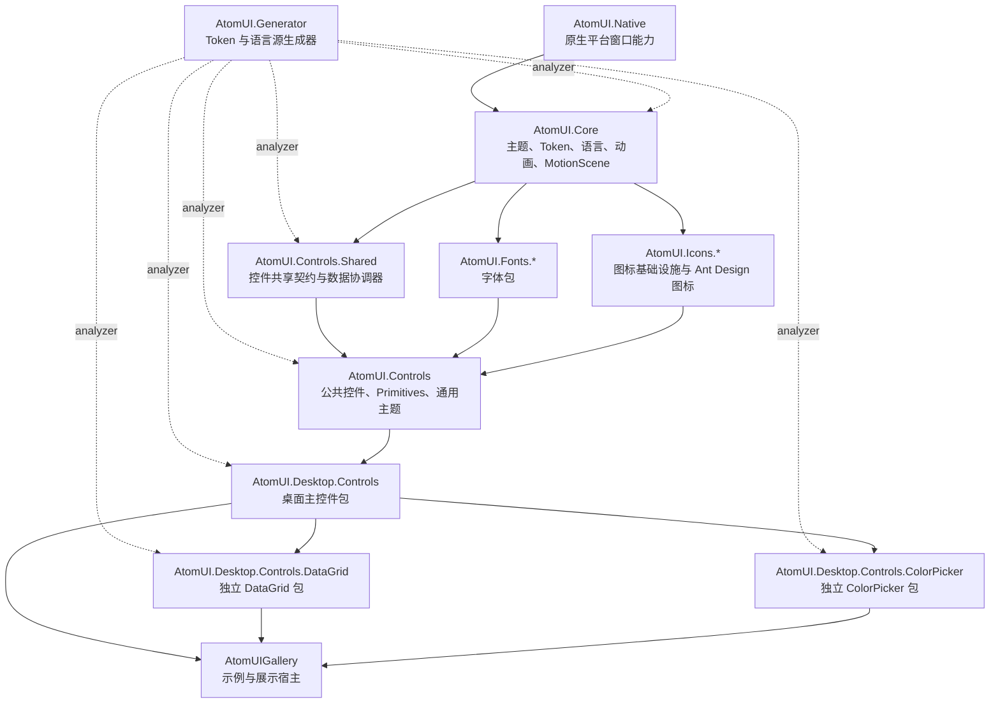

# AtomUI 整体架构

AtomUI 是基于 Avalonia/.NET 的 Ant Design 风格控件库。源码按“基础设施、共享契约、公共控件、桌面控件、可选独立控件包、资源生成器、图标字体资源”组织。

## 架构分层

## 核心运行链路

AtomUI 应用通常分两步接入：

1. 在 `AppBuilder` 上调用 `WithAtomUIDefaultOptions()`，应用平台默认配置。
2. 在 `Application.Initialize()` 内调用 `UseAtomUI(builder => ...)`，注册主题、字体、控件包和可选包。

主题注册链路由 `IThemeManagerBuilder` 收集 Token 类型、主题 Provider、语言 Provider 和初始化回调。`ThemeManagerBuilder.Build()` 创建 `ThemeManager` 后，`ThemeManager.Configure()` 负责扫描主题、创建主题资源、加载语言资源，并把 `ThemeManager` 绑定到 Avalonia 服务定位器。

## 源码包边界

- `AtomUI.Core` 是所有上层项目的基础设施，包含主题、Token、语言、本地资源、动画、MotionScene。
- `AtomUI.Controls.Shared` 不提供完整 UI 控件，主要沉淀跨控件复用的接口、状态、集合视图、异步加载、上传和媒体断点能力。
- `AtomUI.Controls` 提供公共控件和 Primitives，是桌面控件包的基础。
- `AtomUI.Desktop.Controls` 是桌面主包，负责大多数 Ant Design 桌面控件、Popup/Overlay、Window、Browser 兼容主题。
- `AtomUI.Desktop.Controls.DataGrid` 和 `AtomUI.Desktop.Controls.ColorPicker` 是按需引入的独立桌面控件包。
- `AtomUI.Generator` 以 Analyzer 方式接入多个项目，生成 Token 资源键、ControlToken 类型池、语言资源键和语言 Provider 池。

## 横切系统

- 主题与 Token：由 `ThemeManager`、`ThemeManagerBuilder`、`AbstractDesignToken`、`AbstractControlDesignToken` 和源生成器共同完成。
- 本地化：控件包声明 `LanguageProvider`，源生成器生成 `LanguageProviderPool`，注册时统一交给 `ThemeManager`。
- 平台适配：`RuntimePlatform.Features.SupportsNativeWindow` 决定桌面/浏览器主题 Provider 和部分 Token 注册。
- 控件资源：每个控件通常由 C# 控件类、Token 类、AXAML 主题、主题聚合 Provider 和可选本地化 Provider 构成。
- AOT 兼容：新增绑定、反射、动态数据、ReactiveUI、source generator 和 NativeAOT 发布相关代码前，应遵守 [AOT 编程规范](../engineering/aot-programming-guidelines.md)。
