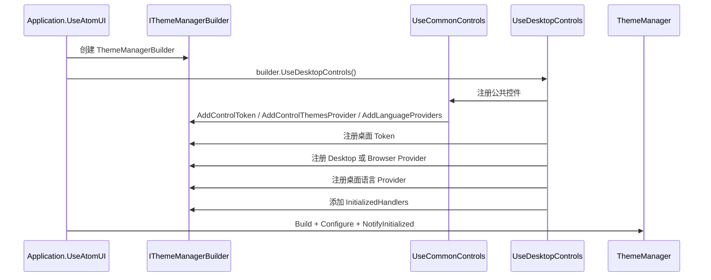

# Desktop Controls 主题注册

`AtomUI.Desktop.Controls` 的注册入口是 `UseDesktopControls()`。

## 注册流程

## 桌面与浏览器 Provider

`UseDesktopControls()` 根据 `RuntimePlatform.Features.SupportsNativeWindow` 选择：

- `DesktopControlThemesProvider`
- `BrowserDesktopControlThemesProvider`

公共控件包同样选择：

- `CommonControlThemesProvider`
- `BrowserCommonControlThemesProvider`

Provider 本身继承 `ControlThemesProvider`，通过 AXAML 中的 merged dictionaries 提供控件主题资源。

## 初始化回调

桌面控件包在 `ThemeManager` 初始化后执行：

- 注册 `TransformOperations` 的自定义 Motion Animator。
- 桌面环境下绑定 `ToolTipService`。
- 桌面环境下启动 `MediaBreakPointThemeBootstrapper`。

这说明主题注册不仅加载样式，也负责部分运行时服务的安装。

